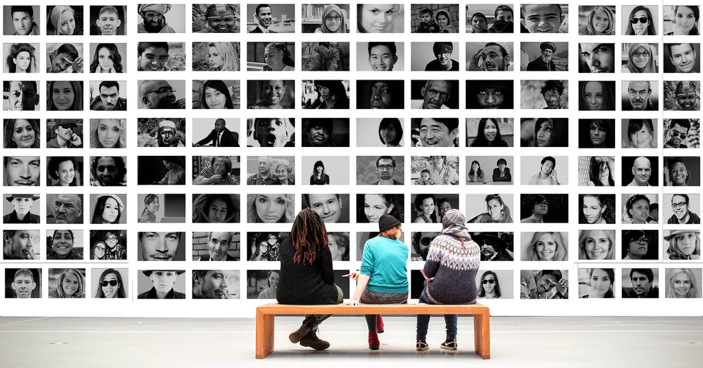

I am reading *Ray Dalio*'s book *Principle*. It's not done yet, while I have something I want to write down to share my opinions on.

*Ray Dalio* is a very successful business person without any doubt, and he is well qualified to teach others about *Principles* which rooted his success in life and work as he stated. *Being radically truthful and transparent* is what *Ray* stressed many times in his book, which leads to his way of putting it into practice. The specific way he introduced to measure the employees' work style(either *big picture* or *detail*) invokes a very strange feeling to me. His employing psychologic or neuroscience approach might be *more* objective as he claimed or even better he wanted to use computer power to achieve the ultimate objectiveness to identify an employee for their strength and weakness.

I feel weird about this approach, which automatically reminds me of the IQ test as a way for the recruiting process or enrolling process. People cannot discuss things about IQ differences which are assumed to be very dangerous due to the implying racial discrimination, and it even reaches the academic field. I don't object the research on IQ as an academic activity, which surely can benefit the human beings in many ways, e.g the role IQ plays in a person's life and work, how to nurture the IQ after nature, the relationship between IQ and other merits(e.g creativity, imagination, entrepreneurship, etc.). However, I do object putting too much weight on it when making decisions whatever it's for employment or college enrollment. Diversity has been underscored for many times by many people when talking about running a successful organization, which surely can provide different perspectives due to the significant difference among diverse groups of people and that's rarely related to IQ, esp. under the present information era, other merits(e.g creativity, imagination, collaboration, etc.) are playing a more and more important role for a successful organization because knowledge is becoming more and more accessible and attainable.

Back to the approach *Ray* did in his company, it is no big deal if he only applies that to his company esp. he is following his *trial and error* approach which I am also a fan of. The issue is how to be objective. His approach always requires humans to get involved in the process, no matter it's his investment model, or his management model(much more complex), e.g deciding the rules or *principles* in his words is from human being which is inherently biased from the participants' background. *Ray*'s overconfidence on computer power or the AI might shoot himself in the foot, and the outcome might be remote from objective and efficient as he might expect.

Even if he could try his best to make it as *objective* as possible, he might also go too far using it, like you see everything as a nail when you have a *good* hammer. Firstly you identify each employee's strengths and weaknesses and put them to their best fit. And then you might think we probably only expect one specific type of personality, so you apply it to choosing people. And finally, you might expect to apply it to your personal life besides work, and you end up being a person who asks decision from a *black-box* of a specific AI box either in your personal life or work life.

The emergence of services like Tiktok or Facebook narrows our information acquisition hugely which always gives anything we expect and always gives us the affirmative opinions with ours. And that will give us an illusion that we're holding the truth as everyone else does, and we also become less open to listening to different views. I think this is a huge barrier in the course of human evolution, which *Ray* thinks evolution is the real beauty of human beings. That's why I do like diversity, and always like to be flooded by different ideas.

*Patterns* or *Principles* are in some way dangerous if we don't have the critical thinking, for it might force you to do things in only one way or only one right way. One correct way thinking is dangerous which might eliminate innovation and imagination. Everyone is following the rules and no one doubts *what if not*.

So far the book goes a bit short than I expected, at least the first 30% which are mostly about his own life and the life principles. As I said, *Ray* is qualified enough to give advice while the content might be no big difference from other *life mentors* like *Dale Carneigie* or *Napoleon Hill*. But I am still looking forward to his *Investment Principles* which might shed some light on my investment life.