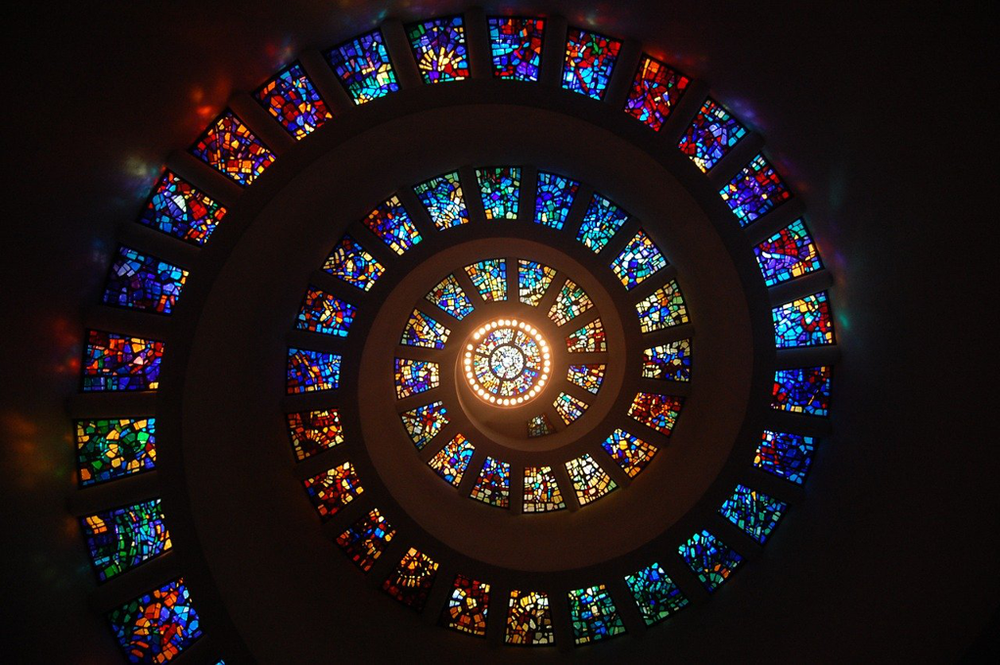

Basically I don't like reading books about purpose-seeking or self-finding, which typically will fall short than expected. And I don't like to be taught about how to lead my life, which doesn't mean I am not open to advice but I really dislike the advices that are too general or too universal without knowing the audience's specifics.

Some tales about monks or nirvana are very famous and popular curculated by word of mouth. We view them as parables, feats, the impossibles, which are out of reach. When talking about those tales, we laugh by mocking them. And also we talk them with respect as an example. We often admit their greatness regarding patience, modesty, being able to fast. After that, we change nothing, and do whatever we used to.

This book is different. It's short. It's not heavy in some way, but it's deep, and it covers the whole searching of meaning of a wise man. Avoiding lust or facing lust are different, and the latter one could be more powerful since it was known and then abandoned for a higher meaning. But we normally respect the former one more for its purity, sinlessness. They are more like the natural saints without any desires but the high meaning above. So Siddhartha becomes more interesting and more like common people, or even more relevant.

Fareware to the past, searching meaning, learning from saints' teaching, feeling close to meaning, self-denial, indulging in desires, feeling lamented and harrowing, starting the journey again, finding instead of searching, etc.

It's like a circle, but it's in an upward sprial. And finally and luckily the man might reach the destiny or nirvana.

This is also why I love reading western gods(including the Greek Gods). They're not perfect and they commit faults as we do. They search for meaning, indulge in desires, be greedy, and even murder. But they are also great afterward by fighting with those sins and drawbacks. They still end up being imperfect but they are adored by generations of humans. Siddhartha is no exception in such a group. He finally became a god after fighting with so much effort.

In contrast, most Chinese gods seem to be perfect. And they rule the world without allowing any criticism or doubt. They're absolutely correct for everything. So we feel distant with them. Still we have some gods that are more like western gods with obvious drawbacks and desires, or even moral issues. The famous *Nezha*, or *Monkey King* are good examples. Those are closer to common people, and they gain more popularity among people. I don't know the profound reason for that, while I am thinking maybe we all don't believe the existence of such perfect gods.

So Siddhartha reached nirvana finally and arrived at the destinty. Not everyone could be with that luck. We might end up being far from perfect, while people are still striving to become better each day, even though it's distant from the perfect. Since at the bottom of heart, we know such endeavor is good itself even without an expected end. We cherish more the process.

I came across with *Hermann Hesse* years ago by picking this book with Chinese translation before dropping in a short time. This time it brought me so much joy and wisdom. Or it's not due to the translation -- since *Hesse* is a German -- but the age. Finally, I can be more calm and easy to confront myself in some deep way.