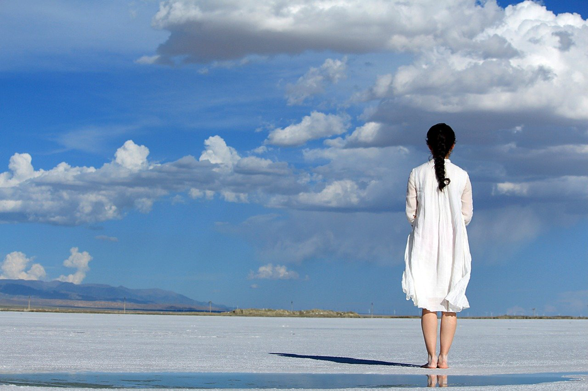

The pandemic is deteriorating across the world. We got a high-rising number of infectious and also the death toll. Lockdowns of cities become a standard practice, and people are quarantining on their own. Social distancing becomes a norm, and people pile on the tissues besides other necessities.

While confronting the pandemic directly in other countries, Chinese people are more worried about the 2nd spread from foreign source. This is really odd with retrospect, since less than a month ago, Wuhan or even China is the epicenter of the world, while things are very different now. We worry about the possible spreads from foreign source and at the same time we try to recover the economy. But who can be so oblivous or careless to risk their own health or even life to play around while other coutries are in such a difficult situation?

I wrote several articles when China was at its peak of epidemic and what we did as a typical Chinese family. We stared at the number every other minute, and we couldn't enjoy any entertainment but news. We didn't trust so much about the information from official source, while we watched around like an alert mouse. We became hysterical when hearing the alarm of an ambulance or seeing person with doctor clothes. We were in the edge of crash.

My family is still under the impact of the epidemic, and my wife and my daughter couldn't go to school and don't know when they could get back to school. I still work remotely. And this period of time is the longest sharing time within us. The feeling is odd but also sweet, at least we know we're together even when it was the worst time. We were concerned, and also we were filled with hope, and we made fun of each other, and we believe this memory would be intersting years later when looking back.

Walking around the locked campus with my wife, we talked about the epidemic, and also the future life together. Something profound has changed in some way undoubtedly, whatever it's the way how you live your life, or it's how we view the world. Even strong like the US, we cannot figure out a cure quickly; even the rich people cannot get out of the bad situation; even the remote village or small country cannot be out of this. We put our own interest over anything else, or our country's interest, which will become very laughable when humans confront a strong and invencible and invisible enemy. This also applies to each individual about his own choice.

My kid is painting very carefully with great patience. She got the skills of playing badminton, cooking, etc in the past several months. Her memory of this period might fade away when time goes. She might encounter this article one day. I don't know whether she would remember this odd period of her life, whether she would remember how we played badminton in our living room, whether she could remember we read together. It doesn't matter that much, because at least I know and she knows her family was living this difficult time together.

My wife told me that we never consumed so much rice and flour in such short time, and she claimed that cooking is not hard at all. I smiled, and said, "I believe so. We should cook more even when the epidemic is completely over." We all agreed and smiled to each other.
