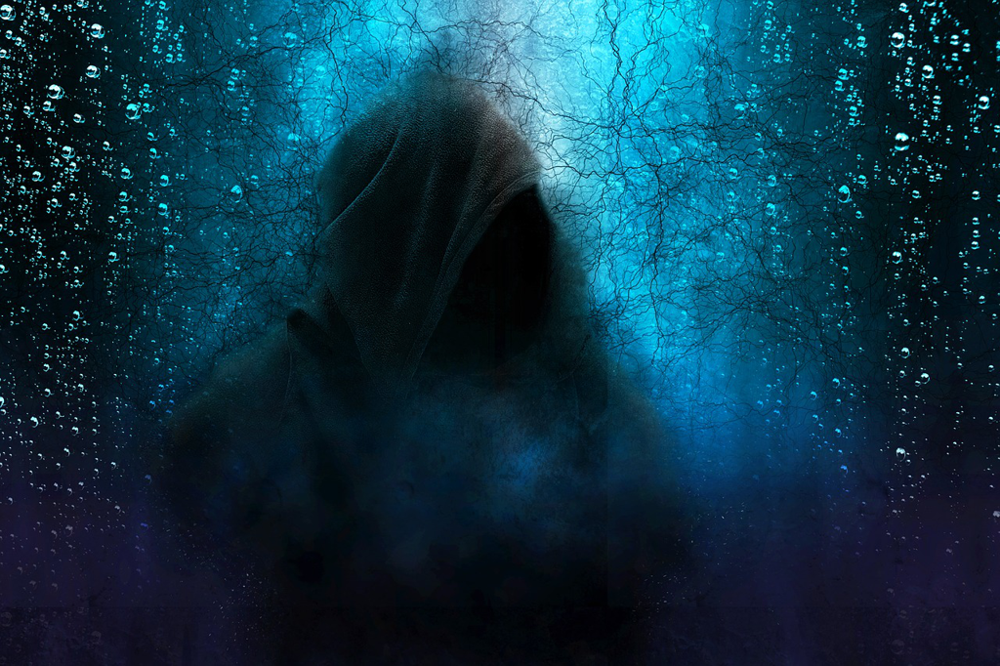

After reading *Hermann Hesse*'s great book [Siddhartha](2020-03-24-Siddhartha.md), I picked up his another masterpiece *Steppenwolf*. Yes, I did. And it's another mindblowing book to examine your life in a deep way, which is so deep and makes me feel a bit drowsy. Or that's because it was written for someone like the main character in his fifties. Finally I gave it up by reading something thrilling.

That comes to *Dan Brown*'s *The Da Vinci Code*. Yes, it is an old one that has been living in my to-read list for so long. It's a good read for sure even when I only read around 15%. The suspense pushes you around and makes you unable to put down the book, which it's easy to get immersed fully into the plot and forget anything around, for a period, even though it might be short.

Knowing the death toll, knowing it's near you will make you have a very different view about life. You feel the death is so near, even though you might end up with survival. Examining oneself might be important, but our patience wears thin in the period of crisis. At least I cannot focus fully on my deep voice, and it's very easy to get diverted by different sources of information.

Walking down the road with my family, watching a worker driving the excavator to dig the earth, looking at the kids running around, listening to the siren to tribute the dead, etc. We're mourning the lives that have been deprived by the coronavirus. We're also praying for the end of the pandemic.

We're still far from the triumph and the bad thing is that we don't know how far. So we stay tight and we follow the orders, and we put our hope to those scientists to develop the vaccine quickly, and even more quickly. 

An old friend asked me to go to a famous park today, and I refused delicately, and reminded him to be careful. A lot of Chinese might think the virus is over, at least in China. But the truth is we are not sure yet. With that in mind, we'd better be more conservative, which surely would reduce our own risk, and in the meantime we would also reduce the risks to others. And he did make it, and posted his photos with mask on. *That might be fine, and I might be a bit over.* I murmured this to my wife.

After writing this, I will go back reading the thrillers that are so helpful at this period. If it's like a nightmare, I'd prefer to sleep it over.