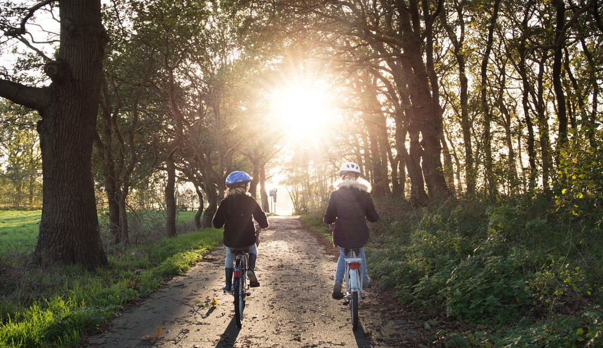

I got a fever since Friday night. Sore thoat, cough, feeling cold, being unable to sleep. Those symptoms made me miserable all night. Starting from a very young age, I always had nightmares when having a fever. A ghost will chase me off the cliff or kill me in someway. In the meantime, I sweated a lot, and my body temperature reached a very high number. Hopefully the next day I will recover from the fever, which is not always the case esp. when I grow old.

I read a saying somewhere that *Being sick reminds the closeness of death*, and I love this saying very much. In countries like the US, Britain, Japan, China, etc, we've already defeated the poverty and we no longer worry about the food, which might lead a life that we forget our health or the death. Only the moment of being sick could bring you back to think about your health. And we might forget it again once we recover, but that moment is important and meaningful.

Another bad thing is that we are still under the epidemic. And the normal medical service is not back to normal yet, which means I might have to face the quarantine for 14 days. It's kinda unacceptable because I have a lot of work around. Fortunately, we have a doctor friend to usher me to the hospital to get treated, which saved a lot of time and troubles. After taking the drip I feel much better now.

1 hour ago, I took my daughter to ride bikes. You can imagine how amazing that might be. For a little girl, he could manage to ride within 2 hours. And now I don't need to watch her any longer, and just stay remotely to wave to her and cheer to her. Watching the blue sky with my wife, saying some trivial things, being with a little bit of sore limbs, I am thinking we don't expect too much, and we just hope we are healthy and the pandemic could end ASAP.