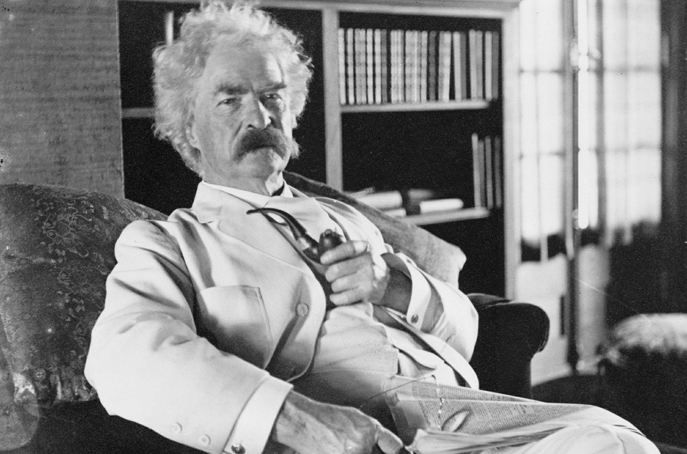

> All modern American literature comes from one book by Mark Twain called 'Huckleberry Finn'

This famous quote is from the famous Ernest Hemingway. I am a big fan of Hemingway, so years ago when I heard such saying from him, I wondered why such a high remark for such a *child book*. Picking up the book from the bookshelf, which is inundated with ashes, I cannot drop the book for a second.

*Tom Sawyer* is a good book, and I really enjoy its witty plot, its lively talk, its interesting adventures, not to mention it could easily remind us about our vivid juvenile time and how to fool around with girls. 

What I love Western classics best is that it doesn't always give a moral indoctrination. They don't expect to teach you the right things, while mostly they only want to arouse your interest about surroundings. That's why *Tom Sawyer* is not a righteous young fellow, but a mischievous wily brave lad. He loves adventures as we do, and he loves flirting with little girls as we do. He wants to be a hero, a pirate, a robber to live the Robinhood life, as we do. 

The vivid narration about how to interact with Becky is also very charming. Little boys always like flirting with little girls, and the author could give a very precise and interesting way to put it, which stimulates a lot of laughter from me while reading.

So I am continuing to read the sequel, i.e that exact one Hemingway gives a very high remark. It is a different perspective, and it still continues its magic spell to the readers.