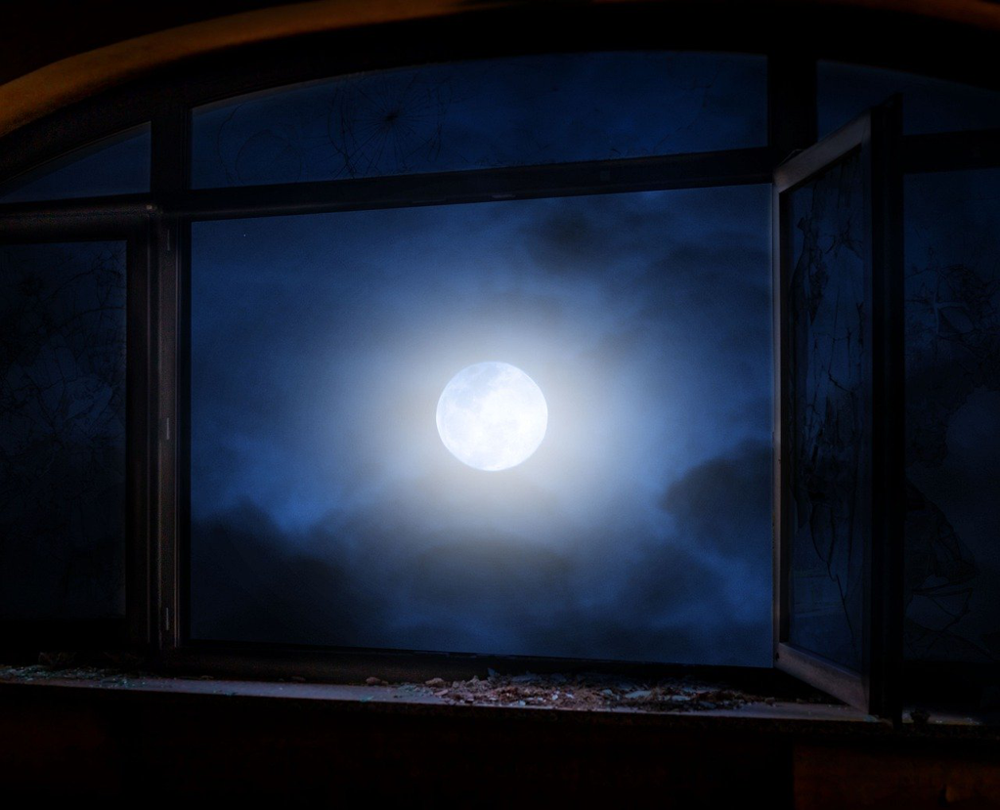

Some books are always around your head, here or there. Wandering in a bookstore, scanning in Amazon, even checking the bookshelf, they will jump out like a ghost, but a very familiar one. Seems you know it well like an old friend, and you know its personality so well, and you know you could enjoy an afternoon with a decent coffee. *Moon and sixpence* is absolutely one of them.

"I don't feel I am living a meaningful life. It's like wasting time every day, even when I work very hard each day." My wife complained as usual to her job. She is a kindergarten teacher, and her dream was to become a high school teacher, and obviously kindergarten is not her dreamland.

"We shouldn't care so much about other's opinions. Every job whether you like or not -- it's normal that most of us don't like it -- is meaningful if you could live each day with your devotion, with the desire to make it better. The result might be out of hand, but the process is just as important." I replied.

"Well we are ordinary persons and we are desperate for our peers' praise. It haunts like a ghost and discloses itself in every corner of our life. We gossip around about someone's income(an indication of success), we share photos to harvest envies, we complain about kids' *almost* full marks to hint something opposite. Even now our kids start to share and become so eager to others' upvote or kudos." She said.

"I am kinda sick about those superficial things. It's okay if you really enjoy them, and I believe you cannot help doing that every a few minutes. But I also believe there's something more important, deeper, that root in our heart. In the end, what weighs most is our own peaceful mind. And the value comes from yourself, your ways of doing things and contemplating things. " I said.

She agreed for a bit, and I know it's a bit reluctant, esp. tomorrow things will be more or less the same, while at least she pulled her together from her low mood about doubting her value.

*Strickland* is no difference with us before 47. Earning bread and affording the family with the sacrifice of his deep interest in painting. And for us, and that's why we don't appear in any great novel, we keep going till the end, with the regret in our heart, in the darkness of thousands of nights. He drops all he has, and disappears. It's also trivial like a person inhabits in a big mountain cutting all his connections unless there's a good hand to write all this down. *Strickland* is lucky in our eyes, while he cares nothing. 

You might think I am more like *Strickland* from the conversation between me and my wife. That's not true. I am very homely, and very conventional. If there are two poles, one is caring nothing about others, and another is caring A LOT, I will be in the middle left. I still enjoy others' praise like a kid, while I don't doubt my value if the praise is absent. A lot people might have the same dream to become a painter or a writer, and that's lucky for them, since at least you have something there to allow you to pursue, even though you might never approach them in your short life. I am asking myself what my dream is. I am gripped by a deep sorrow that I cannot give a definite answer that could fire me up immediately. Do I have a peaceful mind? It is NO obviously. But where could I put my mind upon to gain that precious peace? I have no idea.

*Moon* is over our head and seems ostensibly reachable, while *sixpence* might be out of sight, but you could easily and quickly attain it, and then enjoy by spending it. There's a slight sadness within you after a noisy day, and you lay your back on the bed, out of the window, the moon is shining and slowly moving. Tears are trickling down your cheeks unstoppably. Something keeps you up at night. Your heart is searching. You are not ready to submit. You are not ready to drop everything. You are not ready to disappear. And you might never be. Tears are still trickling. 

*Maugham*, with a good hand of writing, could easily narrate the story to resonate with us deeply. *Moon* is still there shining, and out of reach, but we could still enjoy and desire, even though few of us could move the first step. I don't think that's a pity, or it might be if you could not find any joy around, which is normally not the case. *Moon* over our head, *sixpence* in our pocket, we're ordinary, homely, living our short lives, which might be not perfect, or even not *good*, while in some way it's the result after our struggle in those thousands of nights, and we never easily submit like a coward.