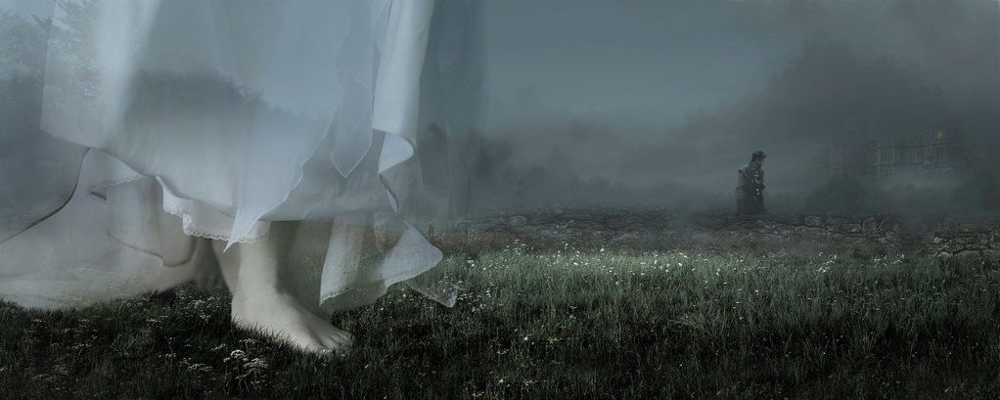

The three sisters of *Bronte* are known by me for so long, while it was not *Emily* that came across me at first, but *Charlotte* of her *Jane Eyre*. It was high school time, when I was still very young, and full of passion with reading, and *Jane Eyre* just appeared and hit me significantly by its pursuing of love. That story is simple and doesn't involve so much misery and revenge which could stimulate us more or less while reading.

And then it's *Wuthering Heights*. It is absolutely a masterpiece, while I didn't have the chance to peruse it until recently. It's difficult at the beginning. The words *Emily* picked, the way she narrated, the dark characters she depicted, the miseries they went through are all haunting around while reading.

I feel deeply moved by watching the steps *Heathcliff* paced. It's like walking into a deep cave where you know something precious at the end, while you have to hurt and revenge the ones around you who hurt you before or who are the kids that hurt you before. It's not virtuous and righteous, but it also makes me feel his conduct justified and a little compassionate to himself. He is not a villain but a victim, and you could see and feel his anger and indignation over the course. He never stopped his deep love till his death, and he had finally gained bliss when approaching the end of his life.

I am also amazed by how a person could be raised and changed. Though it might be just a novel, and it's far from real, I still believe the role the surroundings could play in a person's growth. For me, I still remember the days when my family was very poor and couldn't afford the good food, which made me grow to a person who hates wasting food and becomes a bit stingy. I am thinking that might be a good example of how the environment could do to us, since we were all eyes and ears, and we learned from our surroundings eagerly esp. when we were little, whatever it might be good or bad. Then it'll become difficult to change once you grow old, and it might be with you till the end. That's why *Master Linton* turned from a *good* boy to a *devil* that amazed me a lot.

Back to the family, it spreads over two generations with an accident of adopting a miserable infant. And the love was kindled between the two kids who had been playing and talking together, which ended up being separated forever. His suffering might twist his personality and he determined to revenge, which slipped to the next generation. The two *Catherine* could also trigger a lot of sighs and pities from me. Her personality is what I like a lot, not only in the book, but also in my life. She is pleasant and a bit oblivious with a very good heart. She is determined and easy to win love from as *Mrs. Dean* put it. And also the love *Mr. Linton* to both *Catherine*, *Hareton* to *Catherine*, *Mrs. Dean* to the whole family is also so grand and fascinating.

There might be bad books as a bestseller, but there's no exception for a book that could be read and reread after hundreds of years to be a masterpiece. We just feel the love that deeply moves us, esp. when we grow old and understand the shortness of life. I think it's so difficult not to submit to their striving for the love within the short life, and look at them and think about them aghast with respect and a bit envy.