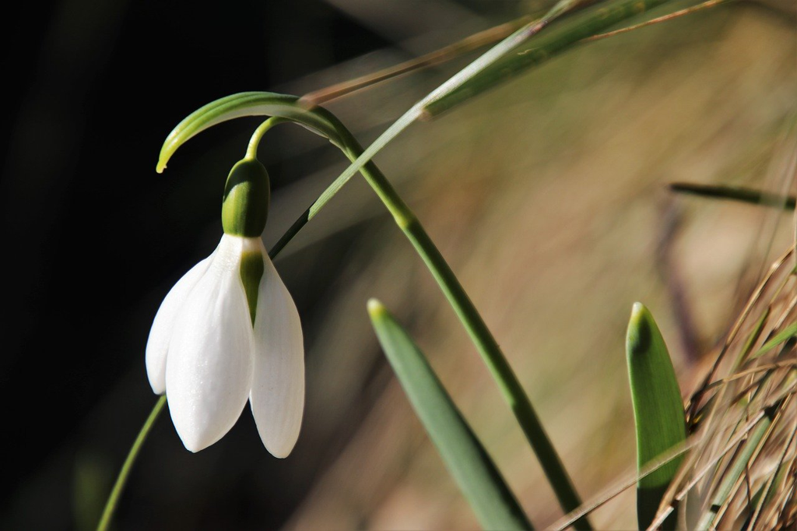

This novel might not be that famous, and it just accidentally came across me and gave me a good time while conveying some ideas that might be not *novel* today, but they're the real precursor decades ago.

Comparing to Chinese novels, esp. the *classic novels*, Western novels are closer to the individual, to the spirit, to the soul. They are trying to ask some questions that might be a taboo in Chinese culture, e.g what you should do if you don't love your partner any longer. Chinese are more reserved, and keep everything inward without telling anyone, and might lead a despondent life to the end. That's a very important reason that I love reading Western novels, which you are confronting with your real self, the one you might confront in the dark of nights.

No one will be happy or satisfied all the time. And once you find you're in the misery or you encounter a person that you cannot stop thinking of, what could you do? *Think of your children* is so cruel because they're just there playing happily and naively, in your eyes. *They're innocent* and you might give up any *revolt* with reluctance. Or what else in your life you could control and manage? does that mean the life itself? It's just like a deep well, you can never climb out but staying there, with someones who you don't like any longer or you must take the responsibility towards.

Seems to me, the society has been regressive since over a century ago regarding the intimacy between males and females. It seems the society was open with affairs to either the men or the women. They could have their soulmate besides their partner. However, nowadays, we feel like it more a taboo and the last straw for a healthy marriage. The western world might be much better in this regard, while we Chinese are far behind or even worse.

The ideal intimacy between men and women should not be confined within a marriage, or children. I always think there's a better form than modern marriage, but it's even not on the horizon. I don't know how we could adopt to that form gradually, and I don't know how each individual could help the progress, which is more than a pity.

For the book *the awakening* itself, it's not that interesting to me, and I cannot see much from the main characters. If it's a precursor of the coming feminism movement as the critics say, I think that's fair, and that might be something worth spending time on.