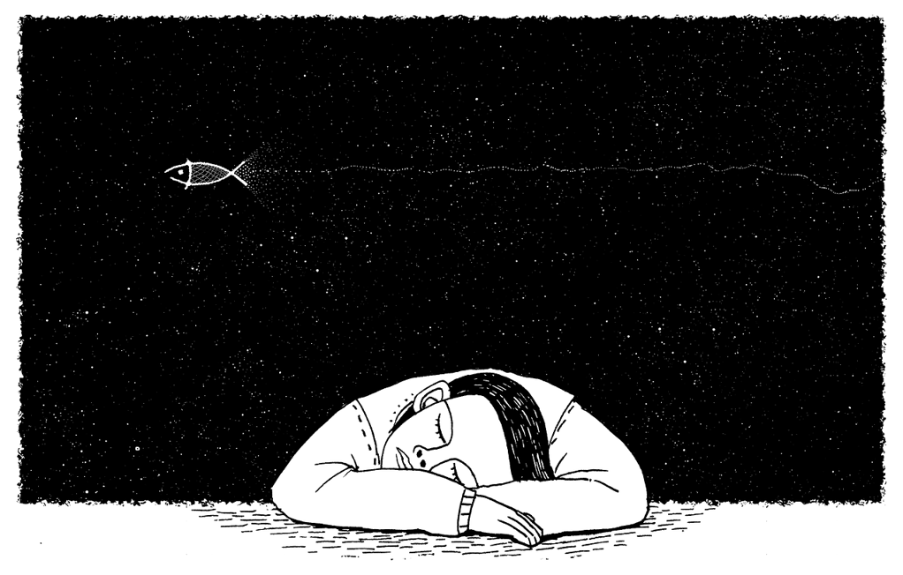

As a Chinese, I cannot understand the race issue in the US. Though we might know something, hear some news, watch some movies, it's remote and far to us, regarding the detail, and the degree. When the recent *George Floyd* event and its widespread movement across the whole country takes place, it reminds me again about a book that has been around for a long time.

*Black boy* is a book that is picked in a *Yale literature course*, which I am learning recently. From its title, it's obvious to be bound with races, while I know nothing about its background, time, until now I have the chance and impetus to read it over.

I read a book about black before, and it's [The Known World](/the-known-world/), which took place too far away from today, and makes it like reading a myth, though it is real and vivid. *Black boy* is near and it's an autobiography with some distortion involved. Therefore, it feels like listening to a story murmuring around your ears by the author. It's close, intimate, convincing and vivid. It can easily provoke tears and infuriation from the audience.

The book has two parts, and the first part is about his early life in the South, while the second part is about his life in Chicago. I have to admit that his life in the south touched me more deeply which displays an image of his daily life as a black boy interacting with his surroundings, esp. with whites. That's as clear as a crystal, and as close as you're watching nearby. How to behave in front of the white, how to contain your inner emotion, how to release them with your fellow blacks, are all very gripping.

The white boss that tries to trick the two black boys to fight or even kill each other seems very fascinating. Sometimes it's very difficult to understand how cruel humans could be against their peers. And the story about the elevator boy is also very intriguing. The author mentioned that boy might have some Chinese blood, and it just reminds me of a Chinese famous novel character A-Q, who could play very lowly without any dignity to ask for money or other stuff he needs.

The second part is about his life in Chicago. It's both fascinating and weird at the same time when I read the part about the Black organization they form and run, which is almost the same to ours here decades later. I don't know what the magic spell it could play, but seems the spell is extremely powerful and could lead to the very same tactics and strategies in different countries all around the world.

Young people seem to be naive and passionate and more like an idealist. For instance, the US, we imagine it as the final ideal dreamland of humans which will be shattered gradually while growing old. We assume the US has the most democratic society with free speech, while once we know the 2nd part of this book was removed for its first publishing, we might feel a bit disappointed. Anyway, it was finally recovered and combined as its original form over 20 years later to publish again, which makes the audience be able to have a whole image about that time and the haunting race issue there till today.