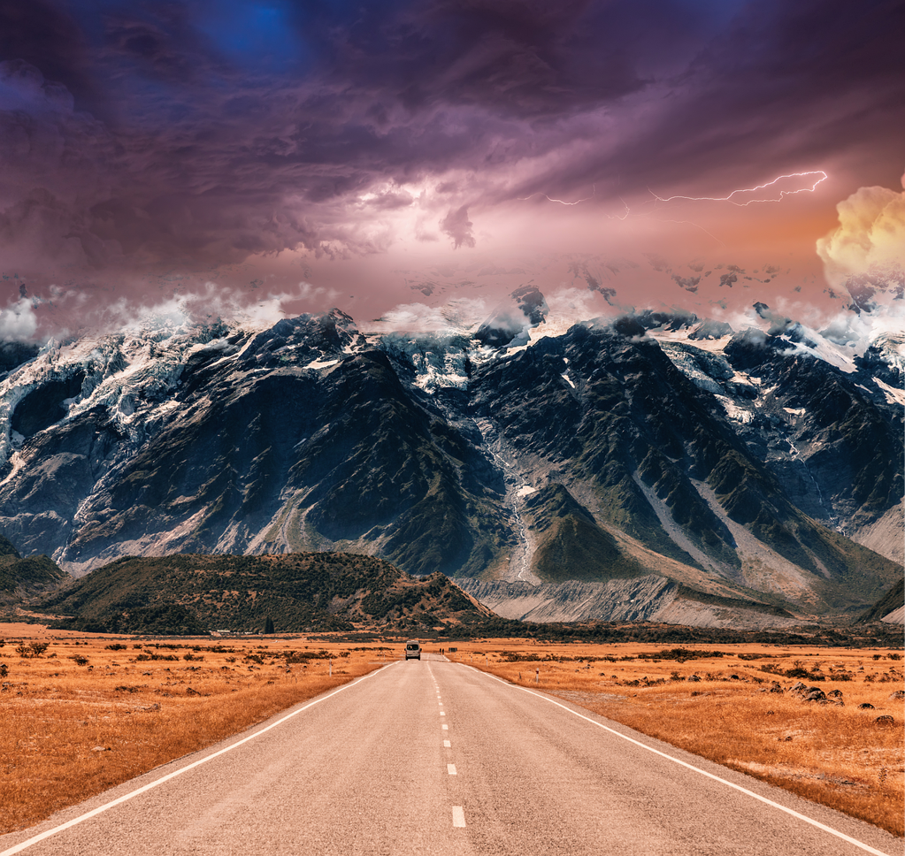

We might call this kind of fiction as *Dystopia*, which creates an imaginary world with a bunch of people. And the world typcially goes wrong in some way, whatever it is. Initially everyone is kind and human, and tries to form a society with rules to follow and goals to pursue. Gradually the conflicts turn up among strong men, which leads to the shattering of the society and different tribes are formed. The worse thing is that the different tribes just hate each other and try to swipe each other. Finally it's not the sense that makes the members pick the side, but it's the scarce resources that count, e.g foods, safety, etc.

Quitting from the normal society and entering a new one, people turn to be more brutal and savage against the outcasts, esp. the one who was the ruler once. There's no sense regarding how to treat a human, and nothing about the goals, but the present needs in their guts. The tribe will act as a whole, which means it's out of control by anyone. And the craze of the tribe will become obvious and significant, and once it starts, it's nearly impossible to end until an event occurs.

We know a lot about *tribe*, and we know how irrational and unreasonable people will turn to be when acting as a tribe. We lower our bar of empathy and we become more animal-like. On the bottom of the heart, we know we won't get penalized because laws won't punish a group. We become so indifferent to others' sufferings and even lives, or even we enjoy watching the brutality.

And *Lord of the Flies* is such a book that tells a similar story very well regarding a group of big and little kids in a deserted island nowhere. At first kids are able to keep an order to discuss things and to execute things. And then conflict occurs among the selected chief and another strong man Jack on keeping the fire on to send signals and hunting the pigs for food. The conflict reaches its peak when the fire wasn't tended well and was off, for Jack pulled the watchers to hunt the pigs instead. Hence, two groups are formed, one from the original chief attracts people with sense and a goal of rescuing, while another one from Jack attracts people with food. The winner is obvious. The once bullies in the normal society will become brutal now to boss people around, esp. for the opponent group. It's not just the hate, but it escalates to hurting and killing. Until a rescue team turns up to save Ralph from being killed.

Piggy is an interesting character, who proves sense and reasoning count nothing in a frenetic tribe. People tend to be short-sighted and only worship the physical strength, while intelligence counts none. And it becomes so natural when the group acts as a whole even when it tries to take the thing that belongs to others. Piggy's specs are taken with force and seems everyone feels good with that. And Piggy was killed finally by the crazy people he tries to reason with.

Ralph is also very typical. He summons everyone to form the original society, while he doesn't take care of the society well and let things loose even when his authority gets challenged, which leads the conflict and the shattering of the society, and even the killing at the end. He is not that good that we could feel a bit disgusted while he derides Piggy in public. He is not strong and not good at managing a society. Once things become out of control and his own life is in danger, he is a bit rueful, and he is a kid again.

I believe people will become less human in a remote place without any contact with the outside. We don't feel secure any longer regarding our life, and we are hungry, which makes sense to put those in high priority based on Maslow's theory. But it turns ugly from outlook. Once the group of people re-enters the normal society, and when we try to introspect the things that happened, we are exasperated and very cross. We're shocked by the inhuman activities and we think we can play better if we were them. While I might say we are always overconfident about ourselves.

This story is interesting and thought-provoking. I just wish people can be more kind and human whatever situation it is.