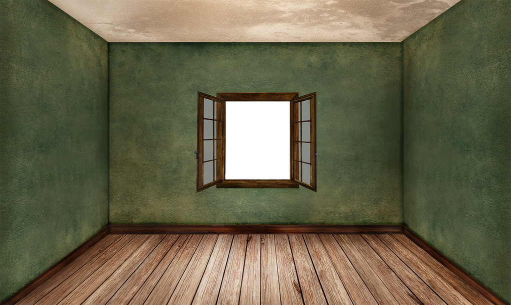

This is definitely not easy reading, and that's caused by my poor English skill for sure. But the story is fascinating and easy to identify with. I might be no longer the age as *Lucy*, while the passion and the confusion are always so vivid like it was yesterday. Jumping like a rabbit without noticing the surroundings or caring nothing at all, even when it's just a telephone call with a girl you like. The weather is no longer ruled by the weather report, but it's ruled by the mood behind that voice.

We're a social animal which means we can never make an important decision without counting others' opinions. Like who you should marry with, or whether you should have your second child, it's not always up to you alone. Therefore, for the young ladies, Mom might change the whole thing with a simple sentence: *he doesn't seem accountable*. And that change is just like the butterfly effect, your life totally gets changed, whether it's from good to bad, or the opposite. The bad thing about this is that we could never be able to find out.

Growing old, growing mature, passion might fade, and we no longer want too many surprises. The girl in the bar smiled and you caught that, while you went away without hesitation, which is impossible if it were 10 years ago. Growing old and feeling lonely, it's difficult to find someone you could talk till midnight, while it becomes nearly impossible when we are no longer brave or passionate. The books are packed in the shelf, with dust, and we don't want that much to move it, which you are so eager to read when you were young. When no once could sit your side and listen and talk with you about the book, why bother reading it at all?

Everything becomes temporal and less spiritual, since everything is pushing to earn more money, and everything costs money. We once watched the stars for so long and trapped so deep, we hardly knew the elapse of the time. Time is so odd, when we were young, we hope it could go faster and everything seemed to be a misery. And when we are old, we find the time is so fast-moving and you cannot stop anything for a bit.

The passion and confusion Lucy was facing is also typical. Who knows what is what? Who knows who is the right one? Or even when you grow old, can you answer this confidently? I doubt it. So it goes with a cliche saying: *follow your heart to see where it leads you*. She is young and passionate, and searching for meanings. That's good for a young lady. But it might be not that good to have an old lady around and guide you for everything with her discipline. You feel fatigued, and you rebel finally. As we're not alone, we cannot just follow our heart. And the leverage is easy to grab by others to stop you from going further, which always ends up with a good(in others' eyes) but not perfect(in your eyes) result. But who deserves a perfect result? You will either submit to the result and marry the guy others like, or you rebel and pursue your own happiness that others object. Will the brave way lead a happy ending? not always, or even it's prone to be bad. But does it worthy a try? Definitely. At least, when growing old, we don't complain about the present and regret so much about not that brave.

Lucy is brave, while her aunt is always an interesting person. The hand behind the scene is hers, and she plays it well. Maybe we must say without her aunt, she will never be that brave, or no chance to play brave. Her aunt is the one who regrets so deeply which she don't want her nephew to repeat the error, and she held out her hand in background.

We love such stories mostly because we are the persons who will definitely choose the weak way, i.e submission. And that just makes us wonder and keep us stay late about: *what if we didn't?* And you feel so lonely even when the noise is loud, and your kids are sleeping tight.