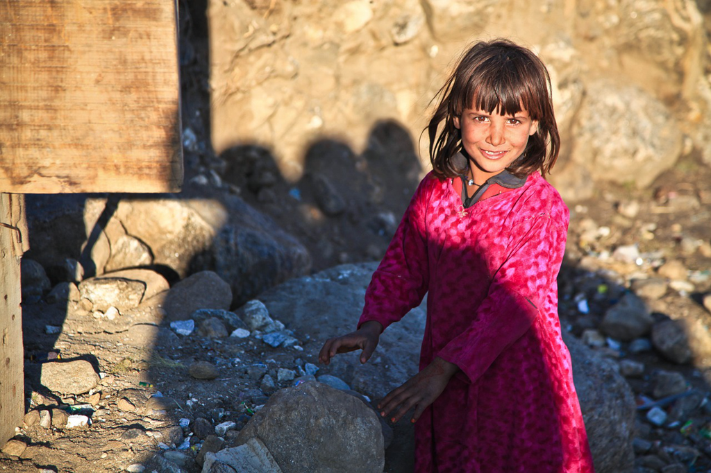

Humans never fail in bad ways, no matter which race you're and which country you're in. The history of the ordeal, the haunting death threat, the ruthlessness towards your country people, we all have so vivid and heartbroken memories. *The Culture Revolution* always stuns me by reading some memoirs, while the tragedy happens in Afghanistan is even worse, since it's so near to today, and even after the year 2000.

We know we're human beings, who should be born equally, while it has never been the case without centuries' fighting, struggling, bleeding and dying. And the road is never flat, and never leads forward, while it is twisted, winding, and even inverting. The good comes, and then the bad ensues, and then less worse is there, and then something good turns up. Those guys just fail us again and again, and failing us never fails. Eventually we don't expect too much but the basic needs, and we live with care, with fear, and with uncertainty. 

*Steven Pinker* tries to convince us that *the world is becoming better*. That's the case in a sense or in general, while it's not true for some minor group on the earth. We throw away so much while some people are still starving. We overtreat our kids in the hospital for the trivial slight symptom while some kids are dying without basic medical service available. I always feel sorry and a bit shocked while I notice how much rubbish my small family can generate per day, and also the hill-like litter in the trash bins around the corner downstairs. We have a better life with the capacity to consume more and better, which is undoubted. Is that all? Are we satisfied? Maybe not. Someone might argue the democracy and freedom.

Yes, I am always a proponent to those universal values, and I always believe that's something very deep that tells humans apart from animals. But for individuals, we might even favor the peace, the security, the stability, the prosperity of the society we're in. We cannot imagine how it would be if we see rockets are falling around us with broken legs, detached limbs, heads here and there as in Afghanistan. In this sense, I give credits to my country for its developing economics, keeping the peace, improving citizens' living standards, and its long-time effort of eradicating poverty. It's not remote or staying on paper only, but tangible and sensible. Walking around the cities, it's obvious and crystal clear that society is in its good shape or even the best since the last century. Do we care about democracy and freedom? Yes, we do, while I must say we weigh the tangible benefits more.

Laila finally made her way back to Afghanistan, just like the scientists, professors who came back to China after 1978 to contribute their specialties to the *new* country. She starts small, bearing the hope of Mariam. She is steady and holds great faith with the bravery and fortitude from Mariam. She might face another revolt, another tumult, or view again the bad things happening, but she will never get beaten down to the ground. Even till today of the year 2020, we can see the casualty report in night news, and that country is still not in full peace and possibly will not be as we can see in future. I feel very sad for the people there.

Covid-19 is still haunting around the world. People are struggling, and might live short in the whole year, and might need several years ahead to get a complete recovery. The virus might be out of our control in the first place, but the war and the fighting are within our control undoubtedly. Can we bring peace to the ones who are still suffering and keep the peace for the ones who are enjoying it?