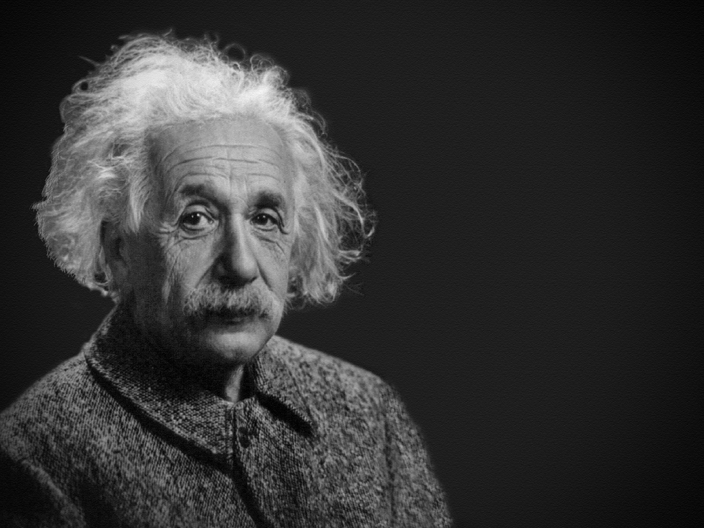

I didn't expect this book could be so interesting. We all know it will easily get very boring for a self-help book on memory improvement, and I would've dropped this one for sure if it falls to that group for the first several pages. *Joshua Foer* is a genius on telling the story with an interesting way on a boring topic, which might mostly come from his background of being a journalist. *You should narrate it clearly but also interestingly.*

In some ways, I am very old-fashioned, e.g on reading, learning, or even remembering things. I believe in externalized material to hold the information instead of our memory. But I often review my own habit or process on these daily routines on learning, and I want to improve them for even a tiny degree if possible. Books like *How to read a book*, or *How to triple your reading speed*, etc were picked up by me now and then for several times to expect some boost of performance, which normally ends up having nothing improved. Even though, I never get discouraged and am always ready for the new findings on this area.

This summer, when we were confined in our apartment, we've got nothing to do but watching some tv shows. One Chinese show named *Best brain* was our favorite. My wife, my daughter and I were always amazed with those talented young guys who could easily figure out a very complex problem. The emotion was strong, and we could relate their nervousness and eagerness when facing a hard problem, but we couldn't relate their smartness and mindset. *They're just not ordinary people*, said my daughter. So that show was just for entertainment, and never left me any possibility to learn from them.

*Joshua* investigated and interviewed the memory champions in the perspective of a journalist, while he also was trained and actively practiced for the next year's competition of the champion title. That's an interesting difference, since most of us would get discouraged by those guys' talents on memory easily, and we just back off. *Joshua* was impressed but not discouraged, while he tried to learn and become one of them instead. That's a hard and bold decision, and even out of reach. He detailed how he was trained and how he practiced, and also the hardness over the course. 

That part *Joshua* detailed the whole process is really cool. Thanks to his profession as a journalist, he made the decision to get the first-hand experience for it, and also the fascinating way he narrated it. Whether it's *Major System* or *PAO* (Person Action Object), they might be very useful in our daily life as an ordinary person, while creating the connection between the object you want to memory and an object in your *memory palace* seems useful in some cases. As a foreign language learner, I know how difficult it is to memory the vocabularies and keep them in my long memory, and how easy it is to forget them. So it's good for me to associate the words with some impressive and colorful things which could make the memory hold longer.

The part about *Daniel* seems a bit off to me, even though it pushed me to do some searches about that *savant*, and whether he is a fraud by utilizing some mnemonic tricks or a real savant. But so far, I couldn't draw a conclusion. We might expect one day *Daniel* himself would tell the truth, or there're some *scientific* (could be proven wrong) proofs to prove he is a savant. However, his success in remembering things has contributed a lot to the renaissance of the public's interest in memory, which itself is very good, since I agree that *we create new stuff by connecting the memory in our head instead of learning from externalized materials*. Eventually we need and depend on our mind and the stored memory, which is accessible or not.