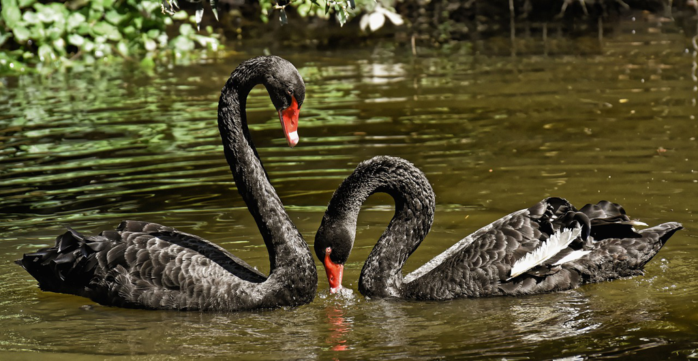

I have to admit that I haven't finished this book. I don't mean it is not a good book, while it is a good book in a lot of ways, esp. the insight of our world and how we react accordingly, but I really don't enjoy the author's way of conveying his idea. Let me explain. *Nassim Nicholas Taleb* always starts with a story and some important *gists* might embed somewhere in the story or it's just a story, which makes you to continue reading to search for the points, which might be very *random*. Hence, the whole reading experience is really exhausting and a bit frustrating, since you might easily miss the points totally. In a sense, this way of putting it just counters what *Taleb* states about *randomness* and *uncertainty*. No one loves such feeling of being lost and for sure, we just expect some easy-to-follow certainty while reading the book.

I feel very lost and also very little of enjoyment and interest. His ideas and insights are awesome for sure, while his skill of narrating a story is not that good. At least, this is not a novel or a collection of fiction, and if I want to read stories, there're always great alternatives. Even for some non-fictions like what I am reading now *a Random Walk Down Wall Street*, which is much better, and the author could put it very clearly, even though there are always stories in between the important points.

And also it's too long. The book becomes a bestselling quickly and has appeared in many recommendations from great people, while the contagion of typical business book is obvious, and the point could be reduced to its one fourth or even less without losing any meaningful information. 

While reading the book, I very often feel that someone is throwing me a lot of small talks and chitchat, which is like the buzzing of the busy bees, while it's hard to follow the points over the course. If that's how *Taleb* tries to prove the randomness of the real world, he made it and I, as a reader, really hate *randomness*.

So what's the takeaway from this book? I put it shortly in my own words:

* Black swan is rare with extreme impact but *impossible* to predict in advance. 
* We should more focus on the *black swans*, since *normal* is often irrelevant
* anti-library: we take what we know too seriously
* *turkey problem*: the hand that feeds you might be the same hand that wrings your neck

He also recommends to drop the reading newspaper habit. For this, I might apply it myself. I am often a bit worried about the deficiency of information or falling behind of the news. After reading it, it feels good and relieved and makes me feel I am catching up with the train of the world, and it hardly plays any role and makes any impact over my life, or even has anything to do with my daily decision-making. It sounds *cliche* but true that *if it's important, the news will always find you.* And also reading newspapers is really time-consuming, which just makes other activities less possible in the scarcity of time. In the perspective of *Black Swan*, once so many readers read newspapers, the news will become less relevant, while the *unread* are the really valuable ones.

For a long time, I am a fan of *randomness* , *probability* and *information theory* and try to view the world with such a mindset. Appling *Bayes' theorem* and the *entropy* in our daily life and decision-making process seems very promising and full of potential. We all know very few from the start, and we grow to know more by learning and experiencing, and then we update the formula for an event accordingly. We learn from the new things, and jump out of our comfort zone to get the more valuable information with a higher *entropy*, and weigh them in the process of decision-making using the *Bayes' theorem*. The whole process is just like an *upward spiral*, and we improve our skill of thinking and decision-making during the process.