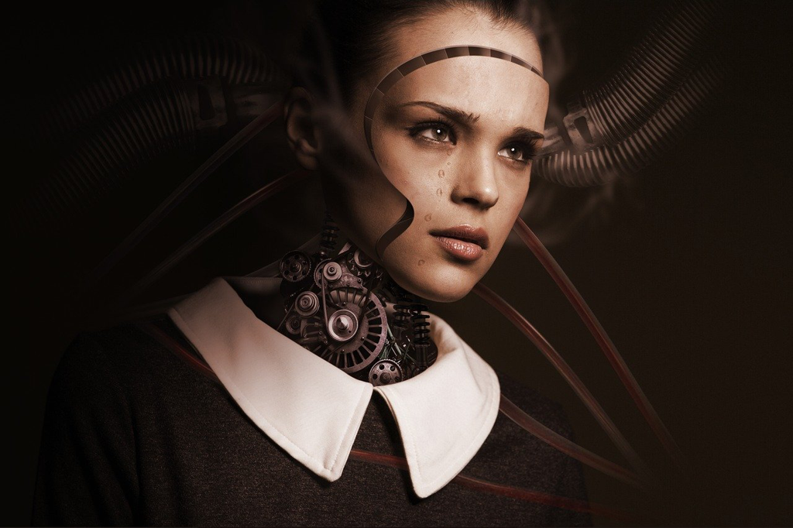

Recently I've started reading *How to Read a book* again expecting to gain a better *understanding* on what I am reading and what I am about to read. This book is not difficult in its literal words, while adopting it to my reading habit is a long way to go. *Nothing is harder than changing an adult's mind*, so does *an adult's reading habit*. Therefore picking something easy and entertaining to read in the interval is very helpful, which is the reason why I picked this book: *All Systems Red*, one of its six books under the title *The Murderbot Diaries*.

It's not a random pick but a recommendation from *Jennifer Pan* in a podcast(*Sinica*) I recently listened to. Sometimes I love such randomness of recommendation which is normally out of my normal to-read list, but also opens a door for a surprise. And this one is not a disappointment in this regard.

We as human beings have never been so close to an alternative civilization, while it might be aliens or intelligent robots. Artificial Intelligence, Machine Learning, esp. the Deep Learning have affected us a lot even without some practical and tangible applications we could encounter in the daily basis -- don't mention the computer vision, or shitty language processing, or terrible recommendation algorithm(e.g TikTok). Whether it's a hype or it could grow to something tangible and impactful like steam power or the Internet, is still floating in the air, but the impact is obvious and tangible to everyone, including the investment, the papers, the discussions, the books, and also the worry for the AGI. I think it's generally a good thing to start worrying about the possible future, since it's so huge and potentially omnipresent.

And one of the tangible agents of AGI is the intelligent robots, whatever it might look like. And obviously the robots will gain intelligence more quickly than human beings thanks to its powerful processing capability. And once its intelligence and ability exceed human beings, what would take place then? Here Asimov's *Three Laws of Robotics* might apply, but it might not more probably. Once the conflict of interests turns up, it might be very easy to predict the outcome by comparing the flesh of humans versus the more durable and easy-to-fix body of robots, not mentioning the huge gap of processing capability.

This robot, i.e *Murderbot* or *SecBot* in this story, seems to be more humane, and it gains intelligence and emotion from watching hours and hours of serials, like an ordinary human who watches a lot of serials. *He* is very intelligent and capable, esp. the perspective of a robot is fascinating and interesting. This is a *sci-fi* book, and *he* is a robot, but we could think *him* as any object who has to face a similar situation. And kids just come across my mind immediately. Sometimes we as adults don't care what kids really want and like, but make the decision on their behalf without knowing what they *really* want, even though they might not know either.

It's a short and easy reading, and it'd better be read in one stop if possible. It is just a very good material for escapists in the still haunting pandemic to gain some slack. Though it's not *hardcore*, its elegant arrangement about the conflict of different surveyors on that planet is fantastic and persuasive, and as a reader, we can easily enjoy it.