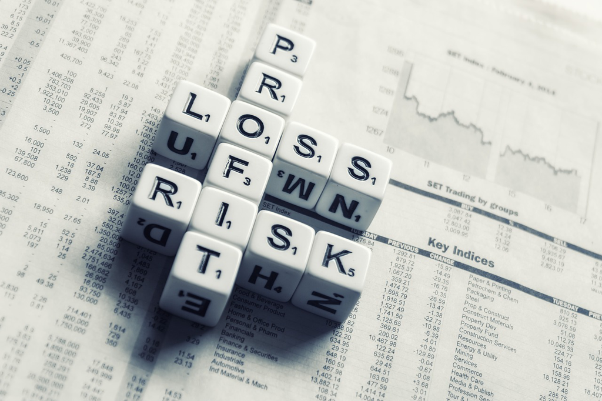

It's hard to imagine how it felt in the US under the 2008 financial crisis. It was less severe in China during that period, though the impact was tangible in our daily economic life. Across the Pacific Ocean, we could only get non-stop headlines day after day, whether it was *Bear*'s merging with *JP Morgan*, or *Lehman*'s bankruptcy, or *AIG*'s bailout, or the historic bailout fund. The news was mindblowing, but also distant. Watching the people going out from the building after *Lehman*'s bankruptcy was still vivid and astounding, even though I pay little respect to *Wall Street* and their roles.

This book *Too Big to Fail* has been on my bookshelf for a long time. As time elapsed, seems what it covers is less relevant and a bit out-of-date, and I cowered for its size too. I still remembered the time when I took the course from *Tim Geithner* in *coursera*, which was a wonderful time and also fascinating for his way of articulating and retrospecting the crisis. And when I listened to *EconTalk*, *Russ Roberts* speculated how *Milton Friedman* would say if he were still alive during the crisis. I am wholly amazed by that significant historic crisis and my passion to read the book came to its peak. And that was the genesis.

The book is a wonderful piece of writing, particularly when there were so many characters and important things intertwining within a relatively short period of time. Due to the significance of the event, and also the time when the book was published, it is a massive project to gather the information, filter, curate and restore the conversations, meetings and details, narrate the event in an interesting style, and avoid too much overwhelming information but keep the entirety of the event. I have to say the author did a great job. And the book is a must-read if you want to get knowledgable about the crisis.

When the book ended on its last page, some thoughts started to echo in my head. For a long time, I am not a fan of financial companies, which I don't mean the traditional and conventional banks that borrow and lend money from people and to companies, but I mean the investment companies which create some so-called *innovative* financial products or play as the underwriters in *IPO*s. I don't mean it doesn't provide any useful and valuable help in its services, but its way of taking risks, its way of handling compensation for managements, its way of playing with the presumption of *too big to fail*, which could end up as bailout by taxpayers. Instead of IPO with investment banks as the underwriters, Spotify and Slack used the *DPO* (Directly Public Offering) to become a public company successfully which might encourage more companies to take *DPO* as an alternative way without paying hefty money for the underwriters.

Another thought is about how high finance works. There're traditional banks(e.g JP Morgan), investment banks(e.g Golden Sachs or Morgan Stanley), government-sponsored enterprises(e.g Fannie Mae), insurance companies(e.g AIG), credit rating companies(e.g Moody's), regulators(e.g Treasury, Fed, SEC). And it's fascinating to know how these people are highly-paid and closely interlocked in their careers, e.g *Paulson* is the former CEO of *Golden Sachs*. And also knowing their luxury life and huge mansions in New York City are mindblowing, esp. the high compensation was still paid when *Bank of America* merged *Merrill Lynch* using the money from taxpayers.

It might evoke your empathy when the author narrates the scene about Lehman's CEO when the company went bankrupt, while we never pay any attention to those restaurant owners who struggled and finally closed their small places, and we just think it is normal and take it for granted. *Big* never means safe even though in some sense we're hostages under its impact, and we are scared when we know it might fail. It looks like a dilemma that haunts around like a ghost. Is there any good way to resolve this issue? Maybe we just forget it and live another normal day until the crisis comes again.

