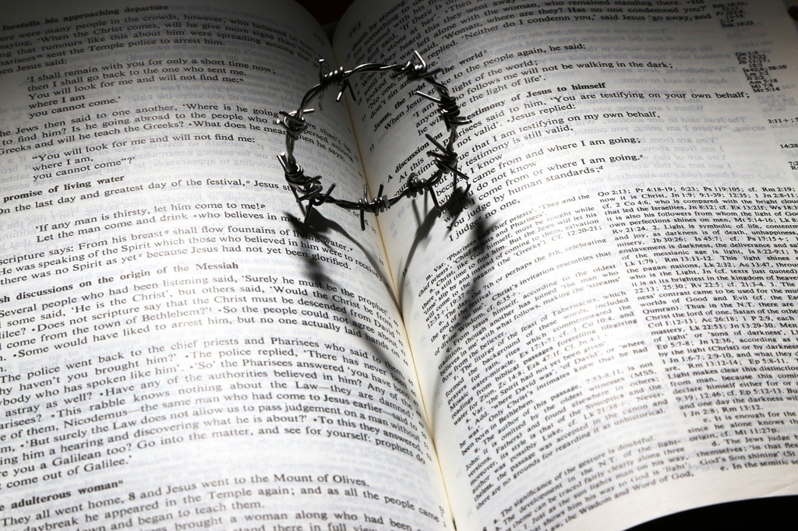

A story could be well narrated that it sticks on your mind for days and you can barely stop thinking. The bar is very low when we were young and stories could easily grab us tightly, while the bar gradually rises as we grow up and read more and experience more, suddently we've become very stubborn and very difficult to move. Hence, a good story is very difficult to pick up and allows me to immerse myself in entirely.

*American Gods* is the book I am looking forward to for a long time. Maybe it doesn't resonate very much with me due to the different background while the story itself is gripping enough to let me enjoy the time. The last time I had the similar experience was when I read *The Three-Body Problem*. In some perspectives they share something common, e.g both are epic to cover a big number of events and people, both are complex with betrayal, sacrifice, loyalty, romance, etc, both cover something deep and huge, e.g the relationship between human and technology(or aliens), religion issues, survival, etc. Therefore, it's not difficult to start to be filled with awe towards the main characters; it's easy to worry about *Shadow* and what might happen against him. Along the roadtrip, it's fascinating to see so many different things or gods or human beings that are like the great drama which has been gradually uncovered on the stage.

*Shadow* is like us or it's the person we want to be. Even though your intimates or close friends betray you, you choose to forgive. Your wife failed you while you decided to save her. Your father set you up to achieve his goal, while you chose to fight back but also forgave. He kept his promise being the helper for *Wednesday* and getting back to be killed by a hammer after the lost game of the checker and reviving his dead wife with his best effort, etc. He is holding the high morality which we appreciate and hope we could reach.

*Lakeside* is a fascinating place, which is peaceful, prosperous but also freezing cold and a young man gets lost for a while. People there are warm and kind, just like the old man and the policeman. The cozy cafe is always welcoming, and town is always peaceful and looks still. It seems to be out of the control of the time and everything becomes slow here or even still. But the young man is escaping due to the many missing cases or the freezing weather or the stifling atmosphere. There is a nice library which allows you to hang around there. The old man(god) keeps the order there to ensure it's always the same for decades and centuries. Each day when everyone crosses the bridge or drives by the lake, the missing kids are frozen in the lake for a long time. Is this a good place to stay? If someone claims that maintaining order comes always with sacrifice and bloodshed, that might be too brutal and expensive. But the people who live there might still keep saying "this is a good town". Does this look very familiar? It's just like revolution or riot, which always involves bloodshed under a promise of bright future while mostly the result never gets delivered.

The battle among gods or the con *Wednesday* prepared and executed has the metaphors underneath, which is not difficult to tell, but even for the literal plots, they are fascinating and very nice to read. Shadow was in the jail and then was released with the message of his wife's death, and then he found the affair and how his wife died, and then the magical coin was put into his wife's tomb, the encounter with *Wednesday*, the roadtrip, the life in *Lakeside*, *Wednesday*'s death, he was hung in the tree for 9 days, the battle on the mountain, etc. 

As a boy, I liked to stare into the deep night sky so much and for so long time, and sometimes I just found a star moved a bit within a hour, or staring at a star and then it just slipped my eyes and then it became a game of hide-and-seek, which might turn up again with a harder staring. The moon was bright over my head and the dark parts reminded me the myth about the moon, and I was wondering what might be beyond the star sky. Every once in a while, an old man would die in my village. I didn't feel any sorry or sad, but happy since we would have movies to be able to watch. It's a ritual that when someone dies, a outdoor movie will be played in the village. Each time, after watching the movie(sometimes it's a ghost movie), the night was so dark that I couldn't see anything literally. By following the familiar road towards my home using my feet, I could manage it but sometimes I was thinking about the dead uncontrollablly while I was stumbling on the road. Where will the dead go? Will they become ghost? How will be the life like? The questions haunted and made the then-short length to become much longer, and the fear grew bigger and bigger which made me run which worsen the situation. I once stumbled and got tripped down and thought I was pulled on my foot by a ghost. The complete darkness inundated me and I felt the expanse and vastness of the emptiness, darkness and silence. Either the distant stars and the deep sky, or the massive and silent darkness, reminded me about things over the presence or the possible existence that is beyond me. I couldn't stop thinking and I grew old to abandon the thoughts gradually.

The night sky is no longer that dark and the stars are less clear. The outdoor movies are gone even in the villages. The nature could no longer invoke the holy and sacred awe as it used to be. *Gods* might become less relevant when the technology advances. We no longer worship them and reflect on our spirits but spend most of our time on the small rectangle black brick-like cellphone. We're lost again, or it's the gensis of the new *gods*?