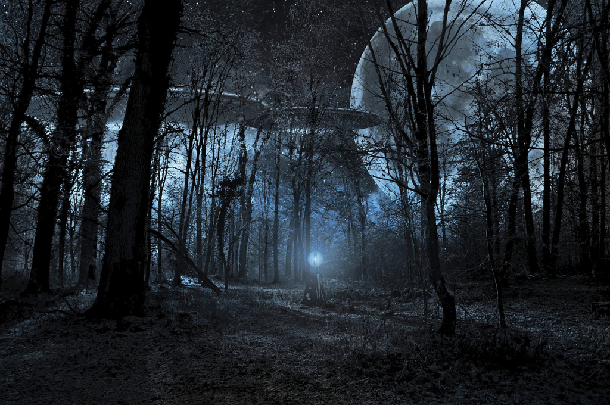

I still vividly remembered watching the movie *Arrival* in Dubai years ago, not for once, but for twice. My english was poor and I couldn't understand the meaning very well, but still felt the atmosphere and sadness exactly. It's not just that you know *free will* is in vain, but also you know exactly what will happen in future and you could do nothing. The deep sadness and pain would haunt you for the rest of your life, and everything just turns out to be meaningless.

Since then, *Ted Chiang*'s book is always on the list of my to-read books, while it always slips for some reason until recently. *Stories of Your Life and Others* is his collection of short sci-fi stories. I heard of a saying that *you are not a writer before you could write a novel*. *Novels* are surely difficult, while it also might become very verbose and even tedious in some way easily, esp. for the sci-fi. *Short* sometimes equals to *less impressive*, since you might get impressed less comparing to a novel. In general, I think this is a legit argument and I mostly agree. Even though I love the two short stories a lot, I still feel a bit of less satisfied, which might be caused by so much blank space and high dense of the plot.

The first short story I love very much is the original story for the movie *Arrival*. I never expected such a short story could end up being a such wonderful movie, and also the thing that fascinated me the most is that the movie's plot is almost same to the original story. By reading the story, the sadness is even more heavy, and also the helplessness. The plot in the story is more subtle and once you finish reading, you have more to digest. The movie is more explicit and easy to catch up. The inevitablity and helplessness are more obvious which might make the movie less sad in a way.

Another story I love very much is *The Lifecycle of Software Objects*. It's about an era that how humans interact with AIs. *Experience gaining* is important for the growth of a kid, a pet, or an AI. Even with a plant or a book, once you share some common experience with them, they surely will become different in some way. Like raising a kid, getting along with an AI object will create some special bond between the owner and the object, which even involves love. Therefore, we might want the best of them, and they're no longer a pet-like thing, and we want them to be independent and can live their own life. If that stage comes, what are those AI objects? And how can we coexist and interact with them?

Reading *Ted Chiang*'s works is always a pleasure, in which he always thinks things through and thoroughly. He never tries to re-tell something in a new way, but tries to give something brand new, as so-called *novel*.