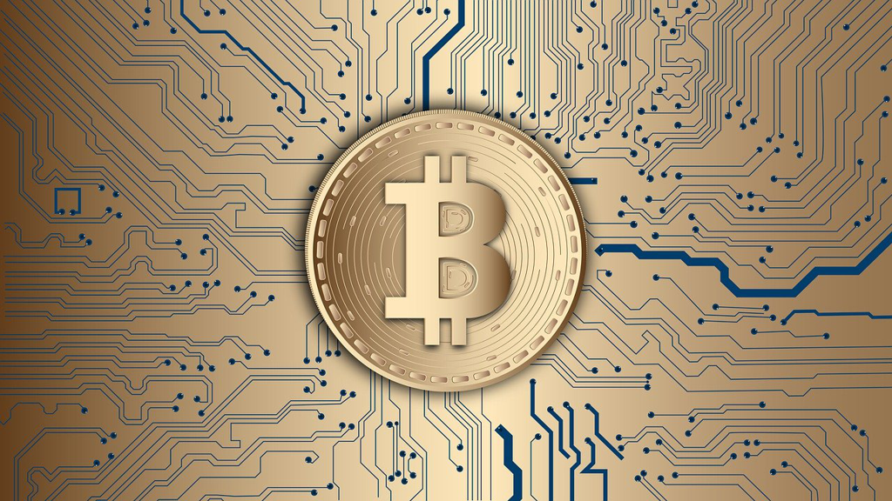

It's like a coincident that *Coinbase* went to public today when I finished this book. *Kings of Crypto* is a book mostly about *Coinbase*, about how *Coinbase* was founded, about how it grew, about the difficulties and ups and downs it encountered over the course, and about the other big events happened in crypto world in recent years.

The events in this book might be less interesting and relevant in such a fast-paced and incessantly changing field. You can learn the history of *Coinbase*, and the mania of crypto speculators, but you cannot foresee the emergence of *NFT* (non-fungible tokens), or the bitcoin price could exceed 60K USD. But it could still teach us something general and that's something I want to cover in this post.

## early adopters

We all know the possible huge return for early adopters, and we also know the potential huge loss is hand in hand. That's why for most of us, we are not the early adopters, and we just missed the *opportunities* one by one, e.g the internet, the smart phones, the bitcoin, etc. So after missing so many opportunies, we reflect and we ponder how to do better when the next opportunity turns up, while it ends up missing another opportunity for most people.

How to be able to sense and grasp an oportunity? It's like how to be successful. Just like the book I read recently, maybe it can only happen when someone in future could mail you about what will happen.(Even there is such a *future* person, you might not believe him and missed the opportunity again.)

A more practical way to increase the odds of grasping an opportunity might include: 1) keep yourself posted with cutting-edge scientific discoveries, business ideas, biology/medicine breakthoughs, etc. 2) be able to take some degree of risk(this depends on your age, family, career, wealth, etc.)

Once you find an opportunity, you'd better invest more time in it to find something that might not be very obvious and something that might be able to push you deeper into it or push you away. At that point, you could adapt your position in it based on your continuously updating knowledge, i.e *Bayes' theorem*. The tricky thing is that you never know something with certainty esp. when it's in its early phase, so maybe it's wise to distribute your investment just like the classic investment book teaches.

## far from settlement

Though *Coinbase* went to public today and cryptocurrency started to enter the mainstream media, crypto is still far from being a mainstream thing, if you count the population in the whole world. The adoption is still low, which is one issue.

New ideas are emerging every day in the crypto world. But most seem to be just a fad or even a scam. They come and go, and some guys become rich and some goes broke. The huge fluctuations of bitcoin price over the years make it very *attractive* and also scary. Being instable seems to be another issue.

It's still in its niche field and lack of killer application makes it less convincing. The believers know bitcoin's good parts comparing to fiat currency, while its biggest issue seems to be the short life since its genesis. I don't think there's nothing that backs bitcoin while fiat currency like USD is backed by government tax. I beileve the essential back of a currency is its commonly shared belief, which makes no difference between USD and bitcoin. But there's one key difference, which is USD has been adopted and believed for much longer time than bitcoin. It's like Harvard vs. a new founded online college, and fame is not earned by one day, which makes the one with short living life more vulnerable.

## Too big to fall

The market cap of bitcoin exceeds 10% of all mined gold and is still growing. And once it reaches a threshold(hard to know the exact number), it will become too big to fall, since there're so many incumbents who are holding so many stakes. And in a high level over a (really) long period of time, such material(tangible or intangible) is just like a *Ponzi scheme*, which requires newcomers to keep the whole system balanced, and if the cake is big enough, a piece in or out won't make too much difference.

Does bitcoin exceed the threshold to be too big to fall? I will give a yes.

Is now the good time to buy bitcoin? Yes and no. If you want to hold long, it's yes, while in a short period of time, the price fluctuates so hugely, it might not be suitable if you don't understand the risk.

## Next

Regulatory issue is still the unknown factor for bitcoin's future. Different countries might have different laws and they might end up creating their own *official* cryptocurrency. Will that make bitcoin irrelevant or obsolete? I don't think so. If countries like *Venezuela* or *Zimbabwe* launched their own cryptocurrency, would people adopt it and give up bitcoin? I don't think so. The bitcoin adopters know the possible inflation well enough to not trust any government or centralized organization, which might make bitcoin more valuable instead.

But it's possible that some countries might make holding bitcoin illegal, while that might not take place in most democratic countries as we could expect.