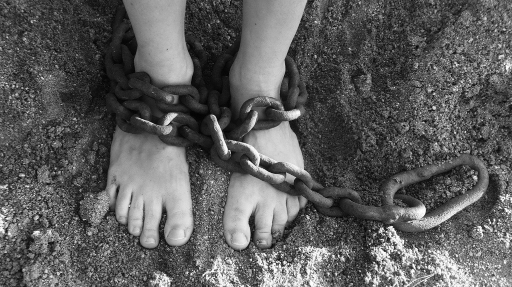

*Maugham* is definitely a writer I love, and after reading his [The Moon and Sixpence](/moon-sixpence/), *Of Human Bondage* came to my view. I have to admit that I was a little discouraged when I found it was a voluminous book. But very soon I started reading with a high spirit after a few pages, since the author's sophisticated narration and plot setting.

It is like a biography of *Philip*'s early ages, i.e from birth to early thirties. It covers the details about how Philip was raised, and sent to school, and then tried to pursue his own aspiration to be an artist, and dropped his artist dream to pick up the same road as his father to become a doctor, and struggled with poverty after losing his entire money in stocks, and finally found his peace and meaning of life after settling down with *Sally*. Of course, there're lots of ups and downs of his life, and different women who interacted with him over the course, esp. *Mildred* who is always with him and seemed to only bring misery to him.

## about defect

Philip was born with a clubfoot, and the deformity tormented him since then. He once wished to the God to fix this and ended up being with great disappointment. And each time, when others got angry with Philip, they would torment him by referring him as *cripple*, and it always made him suffering.

This is so normal for every individual in the world, since big or small, we can always find some defect about ourselves, whether it's your big nose, your odd ear, or your ugly face. That makes you feel bad and self-conscious all the time and become very sensitive. The feeling might become worse when we grow old, esp. when we try to impress someone we care. And when we overhear something that is related with your defect, you'll feel being badly hurt.

I guess this kind of feeling is so normal and common, and nearly everyone struggles with it all the time, until one day we reconcile with it by gaining a lot of confidence by hardworking or give it less weight by growing old enough. 

Can we win an absolute victory over it some day? I am afraid it's negative, and it always around the corner and it might bite us here and there, once for a while. But we could get over it more easily and the hurt would become less until one day we could make joke about it ourselves, and we keep peace with them.

## about love

"Triangle is the most stable pattern", and this is a saying we all know. However if it's about love, things will be less attractive. It's so typical that the girl you are fond of so much has no enthusiasm with you at all, while another girl likes you so much who you won't give a damn. It's such a tragedy, and it normally goes ugly. As a man, you won't give up your pursuit, and keep going after the girl you like and quickly refuses the girl who likes you. The girl you like might be like a stone for a long time, which might wear you out, and you might start to hate her and swear to revenge some day. You keep going and you have a lot of heartbroken days with very rare happy days which are like a godsend. You might give up at some point and get defeated finally and find an alternative, or you might be able to get the girl you want. Is that really you want or does it deserve the hardship over the course? you won't get an answer.

Mildred is the girl Philip cannot forget and give up even after so many sufferings she brought to him. He couldn't make sense and be rational when being toghether with her, and he couldn't refuse any request from her even when those requests were so odd, immoral or even could make him broke. It is mad love as we all know but who can be rational in those circumstances?

## about meaning of life

It's like a *Persian carpet*. 

Once we grow to an age that we know everyone will die eventually, we cannot help thinking about the meaning of life, either from books or from travels. Art comes across with our life, and we embrace it immediately until we realize we might lack the talent, or the reality will teach us about the cruelty of life. We go pratically with life by doing something that could bring us money even though those arduous jobs never excite us. Life is so cruel and it bites us day and night, since the money is never sufficient, and we become a donkey who is pulling the mill incessantly for the scarce food.

"I was born, I suffered, and I died". *Philip* found the life meaningless to justify his insignificance of achievements. But is life really meaningless? If the mundane lives most individuals live are meaningless, that might be it. Even though its most parts repeat comparing to previous generations, and the remaining unique parts might still be less interesting and trivial, we still could enjoy the joys and beauties from nature and from the human fellows.

"Had he not seen also that the simplest pattern, that in which a man was born, worked, married, had children, and died, was likewise the most perfect? It might be that to surrender to happiness was to accept defeat, but it was a defeat better than many victories." Finally Philip reconciled with himself about the meaning of life. Maybe it's not that significant or different or exciting, but such simple pattern is good enough and beautiful enough, since it only belongs to me myself, no one else, and it's unique, and even perfect as it could be.

----

In literature, a lot writers touched similar topic, e.g *Dickens*'s *David Copperfield*, which is on the top of my list now. I want to see a different life from another great English author.