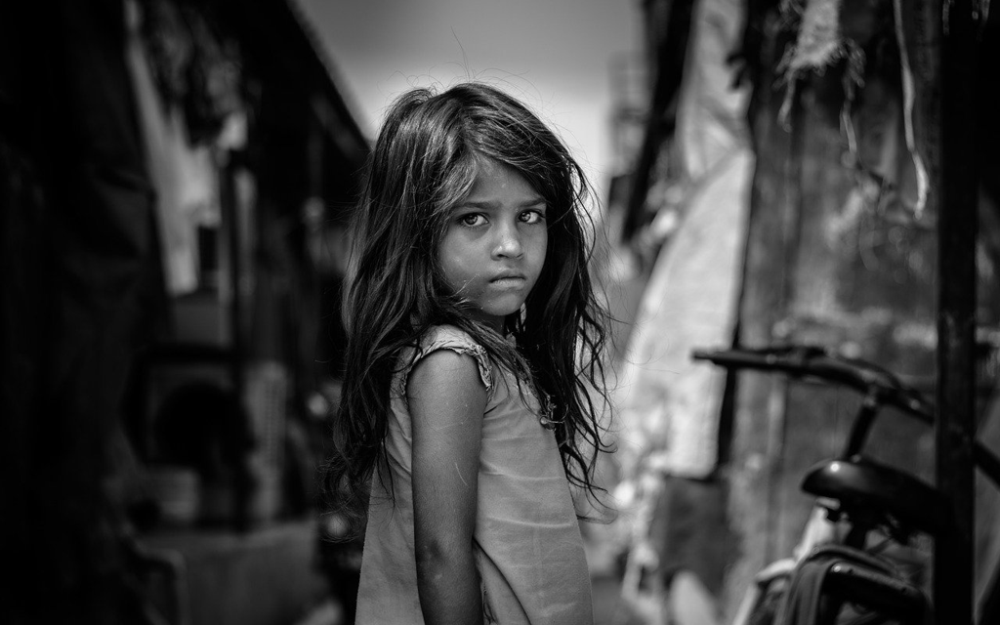

When I was a little kid in my hometown, I could hardly get fancy food or something every kid loves, e.g candies, snacks, etc. But I was never starved. Mom balanced everything between the very little money Dad earned and the expense every days needed. My big brother and sister went to the South to work in factories to earn money at their very early age without taking too much school, while I was the only kid who took the education one by one from primary school to graduate school.
A lot of things are still vivid. Every summer, when it got its hottest peak, we went to the wheat fields to reap manually using the sickle after honing them by Dad very early in the morning. It was blazing hot and sweat always dripped on faces after swiping frequently. I was a kid and didn't know much and didn't appreciate much. I bugged Mom a lot by telling her how tired I was and Mom would know what I wanted and sent me back home to cook for them instead. I was happy and removed everything from my mind about the hot fields where Mom and Dad were working on. In early days, we didn't have the machines, so a lot of poorer people from other provinces would come here and reaped the fields to earn very little money. 
Their faces were sun-bitten and tanned and their figures were very slim like ghosts. They didn't talk much and worked very hard. When it was time for meals, they crouched under the house eaves to eat like wolves. Mom always prepared something decent which might not be fancy but could last long. Sometimes I would send bottles of water to the fields for them, and the image is still vivid: the sun was setting, and a bunch of black figures bent and swung the sickles in a silent rhythm, and the long shadows were dancing on the yellow wheat.

When it was fall, corn fields were ready then. And we three went to reap them, which was even worse, since the corn plants were strong and tall, and we had to squeeze through them and removed the ear of corn to make a heap. The leaves of corn were very sharp and you could easily get scraped. The weather was not that hot but still very hot, and sweat would easily get you soaked and it was a privilege to be able to get out of the plants and breathed some fresh air. And we had to put the heap of corn ears into sacks and took them back home with a wagon. And the stalks had to be cut down and carried back. After that, removing the corn husk, drying the corns, and removing the kernels would be the work lasting for months in day time and in night time. Mom and Dad would work late after my being allowed to go to sleep.

Years after years, everything stayed and cycled itself, while I grew old and so did my parents. We had no scarce of food, but never had enough money to afford anything fancy. My tuition was begged and borrowed by Mom from many relatives. The heat and the cold were always there in my memory to remind me about how cruel the life was.

I grew old and went to school, and hadn't enough time to spend on the fields, which would be on my parents' old shoulders. Books came to me and I never refused. I knew a bit about the cruelty of life from books, which seems to be much worse than mine, and people die sometimes not because of something inevitable but other people. Seems it's not the cruelty of the nature but the human beings.

There're a lot of literatures which depict such miserable lives around the world. I never expect such lives in the US since it seems always so strong and prosperous to me and seems poverty or scarce of food is out of the question, until I encountered this novel *The Grapes of Wrath*.

Similar to my early young life, we used to have people to reap our fields, and then machines came and no more people were needed and they never showed again in my life, and their lives became mysterious to me, but at that time, I didn't care and never asked where they were, and what might change in their lives. *Tom*'s family was pushed away from their land to go the West, which they imagined to be some place with innumerable oranges, peaches, grapes and cotton. They sold everything to buy an old truck, which carried all the members and their stuff. It's kind of like a miracle that they made to the destination, and felt the real California. The jobs were there but paid very little and even not enough for food. People around the country came to the West too and they camped along the highway and rushed to the poor-paid jobs. Over the course, *Tom*'s grandpa and grandma died, and his sister lost her child. The *preacher* was killed by a sheriff and that sheriff was killed by *Tom* then. *Tom* was in his parole already and he had to hide and run after killing the sheriff. The family was no longer complete as Mom always hoped and cherished. Pa was no longer determined about life. Uncle was miserable.

The last scene of novel was stunning. The long rain made the family more miserable and pushed them away from the shelter. And they went into a desolate barn and encountered a dying and starved man. *Tom*'s sister used to be selfish, had a dead baby, and came to feed the dying man with her breast.

Can they survive from the hunger and the rain? Can they settle down some where? Can they reunite with *Tom*?

A lot of questions are there haunting around on my mind after the last page of the novel.