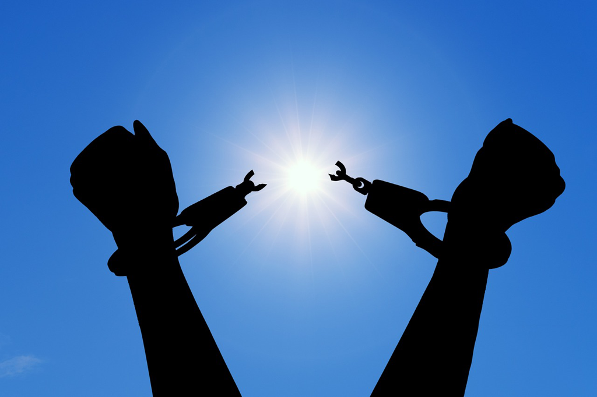

It was totally an accident that I encountered this book, which was when I watched the movie *American History X* and this book was there as the son was talking to his father over the dinner. It always fasincates me when I come across with black race, Jew, etc and their fighting and struggling and suffering for so long. Here in China, as the majority, and also based on the fact that 91%+ Chinese are Han, I never had such feeling of being excluded from the society. Maybe the opportunities are not equal -- which never was and never will be -- but at least you have the chance to earn a good life if you work hard.

So *Bigger* seems to be a very normal boy who was very scared inside but tried to act tough outside, which pushed him to keep the plan of robbing the store, and to squeeze out his fear by fighting with his friend. He went to *Mr Dalton*'s house, and tried to behave and expected to earn and support his family, but things unexpected just occurred while the snow was dancing. *Mary* was very kind and treated *Bigger* *well*, but *Bigger* was confused and raged, since he felt such an overwhelming discomfit and embarass, whether it was the driving car and sitting together on the front row or they ate together in the restaurant. Once he sent *Mary* back home to her bed, he had the impulse to touch *Mary* or even had sex with her and then *Mrs. Dalton* came in and *Bigger* smothered *Mary* to death. In the first place, can I understand *Bigger* of his killing? I might do. Given the situation there, a *Negro* and a young lady stayed together in the same room, which would be easily assumed as inappropriate or even a *crime* in whites' eyes. In retrospection, the *Dalton* might be a little different from the typical rich whites, and might not think this situation too bad, but it was definitely something unwelcome and would be sure to affect *Bigger*'s future work there. *Bigger* didn't know too much about the *Dalton* and held the same hate against all whites, and did the killing. And the following beheading, burning body might seem to be very cruel and savage, but the logic behind was not distant.

*Bigger* tried to ask for ransom, until *Mary*'s bones were found in the furnace. He flight away with *Bessie*, his girl friend. He had sex with her or we could call it *rape*, and finally killed *Bessie* with a brick by smashing her head and threw her over the building. It might be unjustifiable for him about this crime, but it's also true that it becomes easier to do something for the 2nd time. He tried to hide and escape until he was found on the roof of a building and finally was captured and put into the jail.

*Max*, a Jewish lawyer, became *Bigger*'s defense lawyer. It might be too obvious of *Bigger*'s crime to allow anyone to sentence *Bigger* to death immediately, but *Max* tried to dig deeper and to make a change about the society. He had two talks with *Bigger* to understand *Bigger* and the *fate* behind his crimes. If it's *fate* and inevitable, how could he do? He finally decided to kill to be himself and feel free, but was that the only path? *Max* made a great speech in the court about race, class, history, human, etc. But the final sentence was still death penalty. *Bigger* might want to live, but before the execution, he seemed to find some peace in his mind, to feel free and not scared any longer.

---

The story is very powerful, and I especially love *Bigger*'s perspective to move the plot ahead. He just exposed himself to all readers, which might seem to be the opposite from outside. *Bigger* was not well-educated, which seemed to be very natural for a black boy at that era; he had dreams to do business but he never had the chance, which as he said the chance might be dead even before he was born; he didn't believe religion like his mother because he knew the effect of the religion which just made you more a slave, more a machine without any complaints about the society and your fate, and you won't ask and doubt, but accept; he felt scared and insecure when interacting with the whites, and some friendliness only made him more angry and furious, which whites seemed to be unaware and patronizing; he tried to put the blame on Jan, on the communists, who tried to help the black community, but was that only *Bigger*'s fault to be like a snake against the peasant?

I could feel very tight and stifled as *Bigger* in every second while reading. *Taut* is word everywhere in the book with *Bigger*. He was poorly educated and he didn't know too much and couldn't justify his behaviors, but something deep echoed frquently and he could feel something that he couldn't express, until *Max* came to talk with him. And he then could feel it and knew the why.

It's a tragedy for sure, but we mostly make a quick judgment and decsion as the judge and mob did in the story. We are afraid to dig to the *why*, since in a level, we might have to blame ourselves which we never wanted to face. *Kill him* is the easy way to go in short term, but the root is still deteriorating and millions of *Bigger* would turn up.