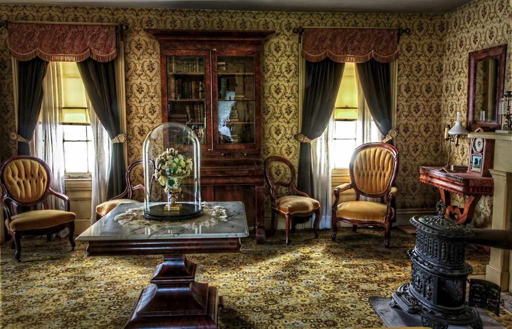

There are a group of people who love the works from *Shakespear*, *Jane Austin*, *Charles Dickens*, and they have a club which share what they've read from the works, and they have a party to roleplay the characters in some famous works, and they have balls to allow everyone to dress and dance like the people in those works. I must say that's a great group of readers, and I belive they must enjoy themselves very well.

Without such a club around myself, I am alone to enjoy the works from *Jane Austin*. *Pride and Prejudice* must be known by every one even in China here, and we all know why a girl tries her best to marry to a rich young bachelor and we enjoy the small tricks and the clever conversations over the course. *Northanger Abbey* is another novel by *Austin*, which is less famous but still very marvelous. Similar settings as *Pride*, there is a different plot, in which the heroine was a nice, curious, calm and pretty girl whose fortune was not big enough. *Catherine* the heroine went to social parties and met with a young man at first, who was her *best* friend's brother, and whose passion all went to his horses and seemed to enjoy bragging around. Until *Catherine* met *Henry*, she was deeply attracted by his countenance, his knowledge, and his smartness. Nothing went smoothly especially romance. *Henry* didn't show up for days, and they missed several appointments(*Henry*'s sister was the proxy). And finally they(the three, Henry, his sister and Catherine) were able to take a walk and grew their acquaintance among each other. *Catherine* was invited to visit the *Northanger Abbey* Henry's home. And the *General* Henry's father made the invitation and welcomed *Catherine* very warmly and treated him very well during the time until the *General* figured out our heroine didn't have the fortune he supposed she should take possession of. *Catherine* was sent home immediately with a bad insult. She was gripped by the deep sorrow and regret and she was herself for days until *Henry* learned what happened and paid a visit to her home. They finally reconciled and went married and gained the *General*'s consent.

The story is simple but still entertaining, even though we already know something bad would surely happen but we don't know what. And another interesting feeling while I was reading was that I was deeply amazed by how the *General* treated *Catherine* so well and tried his best to impress her. My initial thought was whether it was possible that it was not *Henry* but the *General* might be the *hero* and lover of our heroine. I knew it was impossible esp. in *Austin*'s era, but that seemed not that remote to me based on what the *General* had done. If it were true, I might give a higher credit to this book which was much more modern and defied the value the people at that era held. Becasue the value about marriage was so strongly held by the people in that era, it would be a huge risk to challenge that, and that explained why *Austin* didn't. The pace was well executed in the book till the *General* went to London and suddenly sent the message to ask *Catherine* to leave. That episode seemed to be a little hasty and less convincing about the *General*'s motives. And how to fight against the *General* became very very breif or I must say it lacks a lot of details. And then the story ended and our heroine and *Henry* went married and lived a happy life ever since.

I am not exactly sure whether such commedies in ~~Victorian~~ Georgian era could end with a different way or even it could become a tragedy, at least so far as I read *Austin*, the stories all went to a happy ending. While that might be why a lot of people love *Austin*'s works, which could easily address you with good emotion, trivial conflicts, romantic interactions, and a definite happy ending. And we always feel good after reading it.

I might say I want to join *Austin*'s club if there is one around.