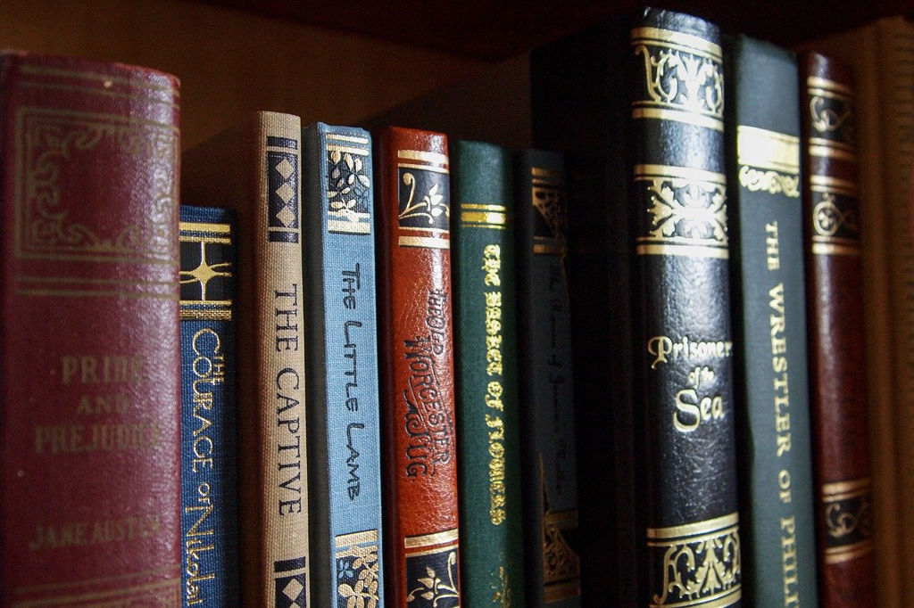

I don't know why the book could grasp me so tightly. It's like a magnet sitting there, and I cannot be separated from, until it's done. It's also interesting that *Jane Austen*'s book is always with a happy ending, which you won't feel sorry or sad once you close the last page. *Emma* is one such book.

It's not the book that makes me sad. It's always a reflection about my life and the ensuing comparison. Comparison can always bring the sadness, since something good, elegant, graceful will always stand out, which dwarfs what we currently own or the life we currently live. The age *Jane Austen* lived was wonderful in some perspective. People could have time to read, to dance, to have parties, to indulge in the trifling emotion change, to understand and ponder about the subtle feelings from each other, which is a huge extravagance to the modern us. Ladies and gentlemen could walk along the garden for hours, and could visit each other and talk for a long time. They could have games like conundrum to implicitly express the deep feelings towards the lady. They took comments towards the people around about their demeanor, their intelligence, their elegance, and the personality. They had a very good understanding about tastes, and there was no such big discrepency like us to hold a very different view about what is good and bad, what is moral and what is not, which makes everyone justifiable about the life style they live. That might be presumed as an improvement for human beings, but it also leads to a lot of nonsense. 

*Jane Austen*'s novels might be about rich people, and you might argue the poor people could never live a life likewise, maybe even worse as the life in *Dickens*'s *Great Expectations*. I think that's a fair point, and it's a little pity that *Jane* didn't depict the poor's life using her elegant pen. *Jane*'s family was not very rich, but her father had a *modest* income, and the atomosphere of her family was *open, amused, easy intellectual*, which might make it hard for *Jane* to be able to portray the poor's life as well as the rich's. And also, as a young lady, it was easy to be attracted by the *beautiful* and *elegant* things, which normally came together with the rich. We can see she must be very sensitive and self-aware, and even made self-reflection very often, just like *Emma*. And this enabled her to write with very accurate feelings and subtle emotions, which we love very much even today.

The history of human society seems to prove that it doesn't necessarily go upwards as we might expect, sometimes it might go downwards. The direction is not all about material resources, or the advancement in science or medicine, but also about the spirits, and pursuing the meaning of life, and maybe the latter is more important. In that sense, we might still go downwards after the advent of the smartphone, which makes the *slow life* impossible. We cannot read a decent book since it has over 200 pages; we cannot watch a decent movie since it's longer than 100 minutes; we cannot enjoy a play in the opera, since it is too *boring*. We cannot help grabbing our phones scrolling down and down for the infinite update and falling into the rabbit hole and forgetting what we were doing. We might argue that it's not the fault of the new technology but the people themselves, which is not the full answer. We cannot deny the effect of the environment over us, esp. when the temptation is within our reach. Watching a funny video clip is easier than a long movie; Watching a paragraph of the main plot of a novel is easier than reading the original masterpiece; expressing your feeling directly and explicitly is easier than writing a poem for days with your full effort. We become hasty for everything and we want to know the outcome immediately whether it's your health check or it's the romance. I think it's really a pity and shame for human beings to give up those wonderful things and only focus on the quick gratification.

---

For *Emma*, I enjoy reading it very much, maybe even more than *Pride and Prejudice*, since I love *Emma* and her personality very much. She was a little self-indulgent and proud, and a bit overconfident about her intelligence and her ability to perceive others' deep feelings. Her relationship with *Harriet* was very interesting, in which readers can find a lot of flaws in *Emma*. What she did cost the engagement for *Harriet*, and later the sad story with Mr. Elton. When *Mr. Knightley* behaved very gallantly to ask *Harriet* to dance, *Emma* thought about the possible attachment between them, but finally found her attachment with *Mr. Knightley*. The interaction with *Frank Churchill* was also interesting, since *Emma* confronted herself a lot about whether the possible attachment existed and whether she should push it or retract. *Emma* was always self-centered, and her relationship with *Harriet* was also to compensate the leaving of *Mrs. Weston*, and later she tried to introduce *Harriet* to the new social cricle which she thought much better than hers to make her be able to grow. And the whole plot about *Mr. Elton* was also all from herself and ended sadly. Especially, when *Harriet* expressed her feelings towards *Mr. Knightley* to *Emma*, *Emma* still accepted the love from *Mr. Knightley*, and sent *Harriet* to London to avoid her own guilt, until *Harriet* successfully built the attachment with her first persuer again. And the relationship between them faded over the time after the three marriages, which might be better for *Harriet*, since it never brought anything good but sadness and even *tragedy*. And also *Emma* used to insult *Miss Bates* in public about her being too talkative, which she felt bad and tried to compensate in the second day by visiting *Miss Bates*.

Seems I disapprove *Emma* a lot. That's not true even though I can see a lot of flaws in her. She is surely imperfect, but she is also very intelligent, open, and elegant. She is someone *Mr. Knightley* could talk openly without scruples, e.g he could blame her about her being too brutal towards *Miss Bates*. She could understand him very well. In some way, they match each other very well. *Emma* could gain some improvement by being together with *Mr. Knightley*, and *Mr. Knightley* can also feel a more true self in the interaction with *Emma*.

Just like *Mr. Knightley* put it

> My Emma, does not everything serve to prove more and more the beauty of truth and sincerity in all our dealings with each other?

That kind of honesty, sincerity and being true is really something worthy a man's life.