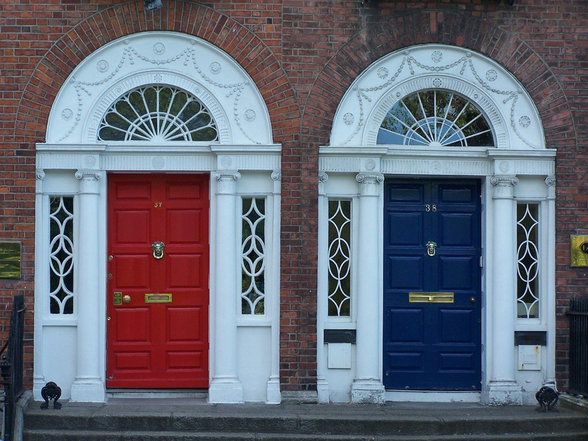

This book is very different from I thought. I heard it for a long time, and knew *James Joyce* is a difficult writer, and it's easy to get lost in his works, but still all these expectations have failed. It's not a novel, and it's more a collection of short stories, which they all seem to happen in *Dublin*. And that's all with the title of the book.

If I see it as a collection of stories, it's hard for me to connect the dots the writer drew aboout *Dubliners*, since the people are not specific in that physical location, and seems it applies for all human beings. *Dubliners* might be just a name, and it tries to extend to all instead of that tiny group of people.

*A Little Cloud* can be a good example. For most people who have won the lottery to come to the world, always put a high pricetag on their own, whether it's intelligence, appearance, ability, or whatever positive stuffs. We compare people around us, and we always have the chance to prove we're better, at least in some ways, esp. after our parents keep telling us that we're much better than the neighbor kids or our peers. We can even find some objective proof to make things more convincing, e.g we can jump over a taller wall, we can have a higher mark in math, etc. Until one day, we meet the neighbor kid or our then classmate again by accident, and we have a weird talk, which is full of brag and boast to hurt the feelings of the person you used to disdain. And the brag and boast naturally come to the money and women. And you suddenly feel sick and badly hurt, since you realize he is still single and open for many possiblities whether it's money or woman. You feel defeated, and you try to get yourself drunk, and leave with a very low mood. You will have a hard quarrel with your then pretty but now mediocre wife, and you might also shout at your kids. You feel the deep sadness and dissatisfication and despair, since seems everything is settled, and there's not any possiblity for a trivial change.

Or the *Dead*. We all know we wear different masks in different situations. It's like life is just a drama and you're a very bad actor. We act, and we grow old, and we remember the old times. We try to have party with friends, which they might be very reluctant to attend but compromise and come for the free benefits, e.g decent food, or some entertainment. At the parties, the tradition will be carried out exactly to allow us to remember the past, where the attendants seem to agree and enjoy themselves. Someone might give a speech to compliment the hostesses, which are filled with blank and empty praise. And finally everyone has to face themselves in front of a mirror, where you can see the real yourself without a mask. And there is a clown in the mirror, who is very funny, ugly and contemptible. One day, we will grow old enough and only count on the memories and those fake parties to continue our life, and we will like to receive the fake compliments and nice words, until we are dead and are buried.

There are also other wonderful and provoking stories in the book. I might say it's a very different reading experience comparing to reading a traditional novel, but it's still a very wonderful experience.