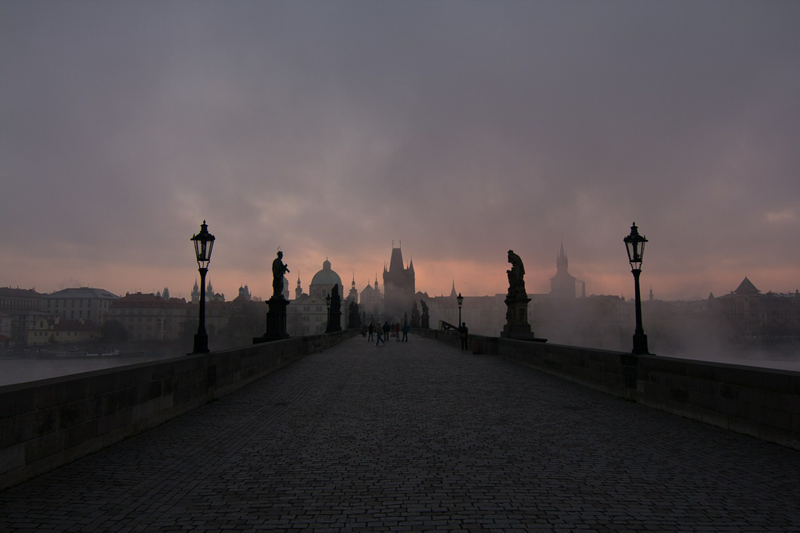

Maybe I have read this book years ago, when it must be in Chinese. And this time, I read it in English translation, and it feels completely different. I don't say English is superior to Chines, but some subtlenss and precision was gained this time while reading. If I have to give my top 10 books of fiction, this book will be definitely one.

Two things can make a novel interesting. One is the plot, i.e the story or the narrative. Everyone loves stories and we cannot ask what's next, which pushes us ahead. And once the ending is uncovered, we might be satisfied with a sigh or by shedding tears or by making a fist, at least we will be filled with a strong emotion. Another is more subtle, and it's about feelings. It's more trivial and deep, which embeds in our routines and our daily small talks. We become happy or sad for some reasons, and then we stare at the dog for a long time. We are facing ourselves. As a reader, we look forward to such real emotion and the true feelings, which can be easily relate to. And we think about ourselves and our struggling and suffering in a daily manner.

Therefore, a good novel could handle these two things very well. If you only have a good story, it might lack the depth towards the inner self. If the author indulges his or his characters' feelings, it might make it hard to follow and might drive readers drowsy. *The unbearable lightness of being* is a materpiece that handles these two elegantly.

I don't know too much history about Prague, but I love the name, which seems to me very similar to Paris, and always reminds me about romance and liberation. I don't know how the life was like when the country was invaded and controled by Russian, but I can imagine it must be very difficult for people to freely breathe and speak. So *Thomas* was removed from his profession as a surgeon, and *Tereza* was removed from his profession as a photographer. Even though their professions were damaged, they still kept their faith to live their lives in their way without too much compromise to give in. *Tereza* still tried to pursue the pure love from *Thomas*, while *Thomas* was searching the meaning and became a rabbit finally for *Tereza*.

*kitsch* might be very hard to map to a word in English or Chinese. It's the ugliness brought up by people whether they are on purpose or by accident. Looking at the history, people were badly treated in most of the time. So when it was less bad, people would be grateful and acclaim the ruler highly. They don't care who is the ruler and what type of society it is, and what they only care is their daily life to have enough(or even good) to eat, and warm(or even decent) clothes to wear, and then a bit of spiritual entertainment whether it's philosophy or religion, and people will declare it a perfect world.

But in most of time, we cannot live in such a simple perfect world. In this case, how can we live with the *kitsch*? Maybe just like *Thomas* and *Tereza*, they chose to live in the country to drive the truck and herd the sheep without caring about the Prague and the Russian, where there's less *kitsch* there and where they could face themselves more to continue their searching of life or romance.