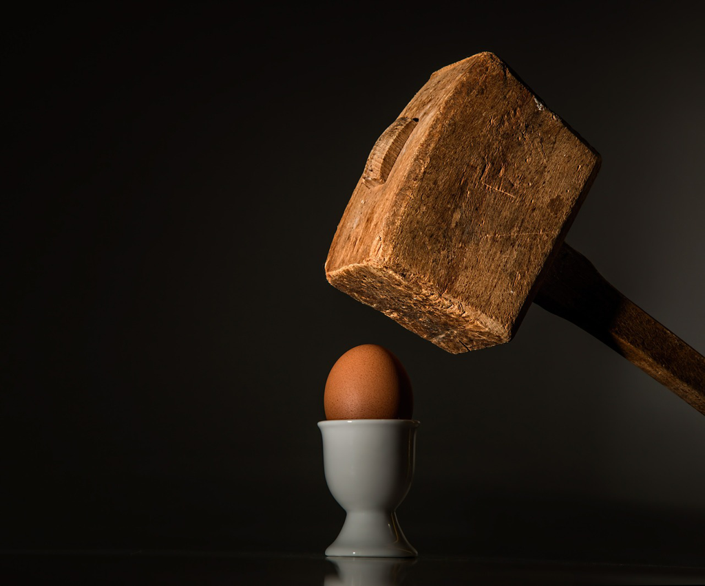

If you are a bookworm, you must have definitely come across with this book *Atlas Shrugged*. The reputation it gained over the years is not fading even when it's been published for more than half a century. The words in the recommendations might seem to be very dull and hard to relate to, while we'll surely feel it, *smell* it and even *see* it once we finish reading it. At least, that's what it brings to me.

I used to believe human beings tend to become better and better in nearly every perspective, while it has been proven false when I know more and more. Maybe more accurately, in a very long time span, that claim is true, while in the short run(hundreds of years), that typically falls short. Material world tends to become better with no doubt, while people keep unchanged and we can see a lot of things happen repeatedly in our short life. Seems we humans cannot get united and cannot try to push the technology ahead and improve people's life, but we are trapped in the conflicts and wars for the material interests or some unnamed ambitions, or even some individuals' egomania. People are killed and kids are abandoned parentless and normal lives are ruined. The even worse thing is that we don't learn at all and it repeats.

So the progress is like a spiral, whose trend might be upward, while for a person's life or even several generations' time period, the trend might be downward. Where are we now? iPhone like devices have changed our lives to make communication easier and trade with less friction. On the flip side, unprecedentedly our privacy is nearly wiped out and we're under tight monitoring every second. The orders from the top used to unable to reach the low level, i.e common people, while with technology, a country is more like a body with one voice towards one direction, without any difference visible. Where are we now? Are we better off than people who lived in Ancient Greek or Song dynasty? Maybe yes for body, and no for soul.

Great novels might be fictional in concrete events within, while it is real in abstraction. It always distills the truth, the authenticity and the genuineness from the concrete events. And those distilled truth is just like patterns which could be found here and there, now and then. That kind of high-level truth is even more important, which reaches the essence of lives and also reminds me what might go awry. *Ayn Rand*'s book is a proof to this.

What is a perfect and ideal world? Maybe it's an Utopia where every individual could have what they want. But how to reach that world is very vague and difficult to imagine if it ever exists. Hence, *Ayn Rand* gives her alternative answer, i.e a world where the highest morality is to pursue their happiness and reason is his only absolute. In her world, people try to be productive to invent and create goods to earn what they need and want; Governments and policy-makers won't have regulations or laws to hinder people's production and the rights to pursue their happiness by trade. Does such a world exist? No. Is it possible? Yes, but very difficult. The incumbents will never give up and will always try to stifle such effort. The deserters approach in the novel might not work either, since 12 years are far from enough to make a change, and also there are always dissenters or cowards or greedy and myopic people to disrupt the plan. And when it requires 50 years or even 100 years, less people will get involved and united but just try to live their own short life even as a *slave* or *exploitee*.

So this book is not just a novel, but also a philosophy book which tries to give a solution to a chronic human disease. Maybe it's not practical as a guidebook, but at least we have a thought experiment which tries to disclose and address this difficult problem. That's why it gains such a high reputation and that's why I love it so much.