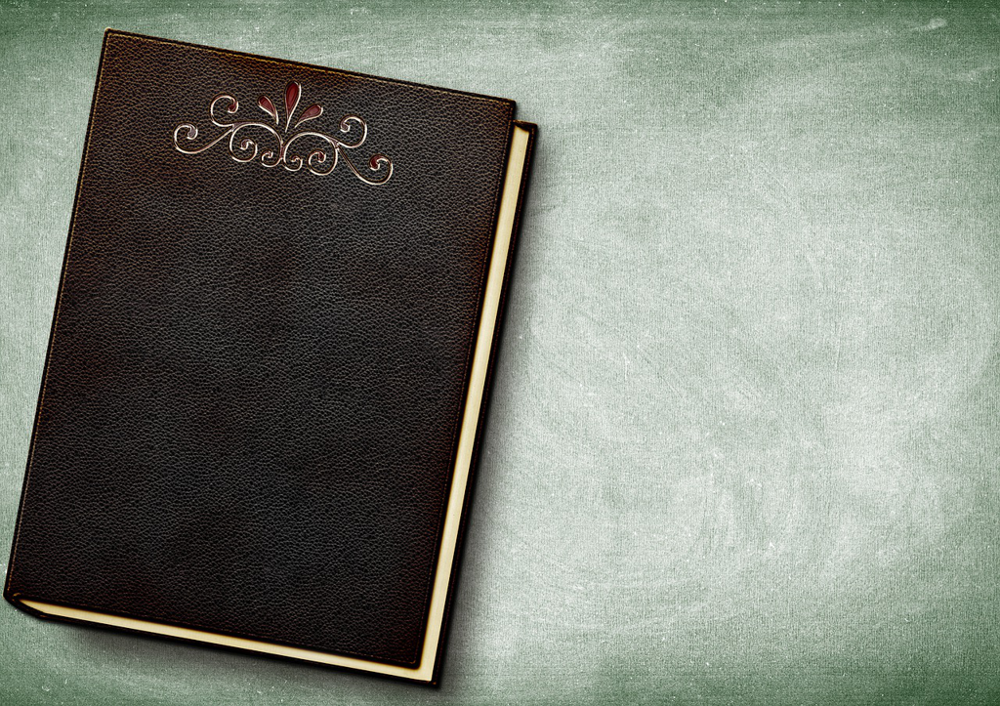

I am not sure whether *J.K. Rowling* was able to forecast the huge success of her book. But actually the 2nd book of the series is still very good, and obviously it's no longer a book which might end as one book but it starts to plant seeds which surely would flower later. And we can see the love seed from *Ginny*, and we can see the *scary* prison, and we can see the *young* Dumbledore, etc. With these seeds, it makes the future story easier to spread out.

In this 2nd book, it's still the same living in his aunt's house but with another hinderance from Dobby, an elf, who tries to prevent *Harry* from returning to the magic school, but surely failed. But it makes us to think who sent this elf and what is behind the scheme. And then we are busy on *Harry*'s life in the school and forgot about Dobby until the end of the story, which also solved riddle that haunted us in the whole book.

The interesting setting of this book is that diary from *Tom Riddle*, and the even better one is to put *Ginny* as the victim and also the blind culprit. The diary allows you to write and get replies from a stranger, which reminds me about a close pen-friend years ago and we exchanged mails with some secrets we wouldn't talk to anyone else. And being able to talk the snake's language makes *Harry* special and even alike to *Tom*, who share the same skill. And with several cases of petrified students, *Dumbledore* seems no longer to be invincible, and the school is no longer safe.

And we know *Harry* will stand out in some way and fix the crisis. But *how* still interests us to continue reading, esp. about the chamber and what might be the monsters inside. Until they figure out the monster is a *snake* living in a pipe, and finally have the chance to face and fight. We know *Harry* will win but the thing is that the *snake* is so difficult to beat, since you cannot see its eyes. And we don't know what role the phoenix and the sorting hat will play. And suddenly the phoenix could manage to peck the snake's eyes to become blind and the sword inside the hat helps too. Putting the sword into the diary is brilliant which finally ends the whole crisis.

But is *Lord Voldemort* still around somewhere?

I guess we need to look forward to the 3rd book then.