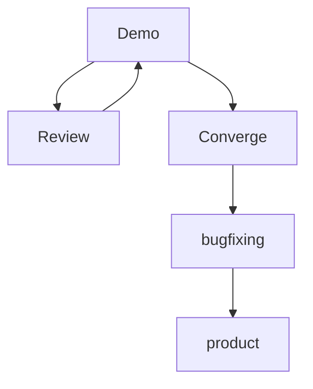

Apple is always a very interesting company for its influential products and fascinating
CEO -- Steve Jobs. I still remember when I got my first Apple product, a secondhand iPod Touch,
and I loved it so much which allowed me to enjoy music and also play with some mobile Apps at that
early time.  And I am still using its iPhone as my mobile phone everyday and it rarely failed me as 
a product.

Another perspective of Apple's mystery is its product development. Unlike Google's developer centered 
culture, Apple seems to be product centered, which means the product manager, the designer and also the 
developer play a similarly equal-weighted role in a product. That's the impression as an outsider. But 
how a product is developed end to end which is always a mystery to me.

There comes this book and it answers my questions very well. The author is a ex-worker in Apple and he played
a very important role in several products, e.g the Safari browser, the iPhone's keyboard, and the iPad's keyboard, etc.
The story about Safari and iPhone is very intriguing and it states the process vividly with great detail. And
the focus on high quality is really impressive which also matches the common impression towards Apple.

After reading, I have some takeaways here.

---

<u>demo for Steve Jobs</u>

- prepare well
    - play with it enough
    - know every in and out
    - also think about the alternatives, e.g when Jobs asked him which one he prefers
        - this is tricky, because it’s beyond his expectation and proposal
        - he was proposing to switch between the two keyboards, but Jobs said to only have one keyboard and asked him to choose one
- take the opportunity seriously
    - otherwise you might be excluded from the circle

<u>the importance of demo</u>

- when the author was working on the browser for Mac, he didn’t make good progress by making Mozilla’s source code work on Mac after several weeks
- Richard(a new colleague w/o too much experience) picked another approach, i.e make KDE run on Mac and launch the KBrowser in that environment which runs in Mac **in two days**
- Change your idea and cut off the corners to make the crucial part to work at first to be able to demo

<u>inspiration and perspiration</u>

- Edison’s rule
    - 1% inspiration + 99% perspiration
- Inspiration does not pay off without diligence

<u>Simple Rule</u>

- Jobs did a great preparation for this keynote presentation and a lot of practice
- details, details, details
- **closing the gap between accidental and intentional**

<u>Hard Problem</u>

- works on the email editing problem, esp. how to make the insertion point correct(note the visual one and the HTML behind the scene)
    - ask for help: **People matter more than programming**
    - even when the one you might have grudge with
- to be honest like the author about what you don’t know and ask help when needed to be able to get out of where you are stuck

<u>As a manager</u>

- ask and become the team manager of Sync Team
- very different from being a programmer
- failed the management role and joined the new project Purple(iPhone) as a programmer
- **Does this demo chose the prototype-to-product gap, even a little?**
    - the expectation of demo is **progress**
- the keyboard crisis: how to type correctly and quickly with a virtual keyboard?
    - the author’s solutions seems good to go
    - they stop all the work and focus on this problem(all 15 engineers with 1 month and different demos)
- **concrete and specific demo to make progress**

<u>The Keyboard</u>

- the author becomes the DPI(the individual who is responsible for the product)
- a key has multiple letters and a dictionary to give the best suggestion
    - doesn’t work well for Contact or non-common words
    - work well for common words
    - might lost track when **stop-delete-retype** problem
    - one letter per key + dictionary suggestion

<u>Creative Selection</u>

- demo→review→demo process will last for many rounds till the demo is acceptable
- high fidelity is important
    - Apple doesn’t like the paper drawing about the prototype, e.g animation, or interaction
    - demo should be very like the final product as possible

<u>Intersection</u>

- heuristics vs. algorithm
    - whether taste or subjectivity is involved in the decision process
    - the Apple way vs. the Google way
    - Google’s best blue color A/B test
    - how to balance between the twos
- Apple’s secret
    - inspiration to create and refine the demos
    - 7 essential characteristics
    - intersection between the idea and the committed people to ship it

<u>Epilogue</u>

- After Steve Jobs’ death in 2011 and author’s leaving from Apple in 2017, the author mentioned the Apple culture has changed greatly, which might lead the degradation of the quality of the Apple products, and also the smooth demo→review-demo cycle.
